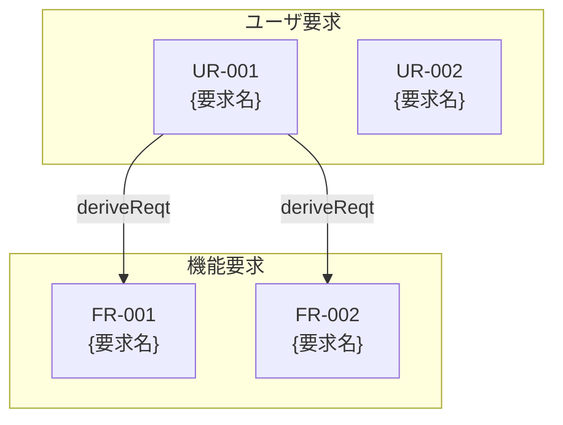

# Generate PRD - 要求仕様書の生成

入力されたビジネス要求から AI-SDD ワークフローに従って PRD（要求仕様書）を生成します。

## 前提条件

**sdd-workflow エージェントの原則に従って生成を行います。**

### PRD / 要求図の位置づけ（参照）

**抽象度: 最高** | **焦点: 何を作るか、なぜ作るか**

| 項目          | 詳細                             |
|:------------|:-------------------------------|
| **目的**      | 製品の高レベルな要求（ビジネス価値）を定義          |
| **内容**      | ユーザ要求、機能要求、非機能要求をSysML要求図形式で記述 |
| **技術詳細**    | **含めない**                       |
| **SysML要素** | 要求図 (req)                      |

### ドキュメント間の依存関係

```
PRD（要求図）← *_spec.md ← *_design.md ← 実装
```

PRDは最上流のドキュメントであり、後続の仕様書・設計書の基盤となります。

## 入力

$ARGUMENTS

### 入力例

```
/generate_prd ユーザーがタスクを管理できる機能。
ログイン済みのユーザーのみ利用可能。
タスクの作成・編集・削除・完了に対応し、期限日と優先度を設定可能。
期限が近いタスクはメール通知を送信する。
```

## 生成ルール

### 1. Vibe Coding リスク評価（最初に実施）

入力内容を分析し、以下の基準でリスクを評価してください：

| リスク  | 条件        | 対応                 |
|:-----|:----------|:-------------------|
| 🔴 高 | ビジネス要求が曖昧 | 不足情報をユーザーに確認してから生成 |
| 🟡 中 | 一部の要件が不明確 | 曖昧な箇所を明確化してから生成    |
| 🟢 低 | 要件が明確     | そのまま生成可能           |

**曖昧な入力の例**:

- 「便利な機能を追加」→ 具体的な機能を確認
- 「ユーザー体験を改善」→ 改善対象と目標を確認
- 「競合と同じ機能」→ 具体的な機能仕様を確認

### 2. 入力内容の分析

入力から以下を抽出・推測してください：

| 抽出項目      | 説明                   | 必須 |
|:----------|:---------------------|:---|
| **機能名**   | ファイル名に使用する識別名        | ✅  |
| **背景・目的** | なぜこの機能が必要か、ビジネス価値    | ✅  |
| **ユーザ要求** | エンドユーザーが求めること        | ✅  |
| **機能要求**  | システムが提供すべき機能         | ✅  |
| **非機能要求** | パフォーマンス、セキュリティ、可用性など |    |
| **制約事項**  | 技術的・ビジネス的な制約         |    |
| **前提条件**  | 機能が動作するための前提         |    |

### 3. 不足情報の確認

入力から判断できない重要な項目がある場合、**生成前に**ユーザーに確認してください：

- 機能の名前が不明
- ビジネス価値・目的が不明確
- ユーザ要求の主語（誰が使うか）が不明
- 成功基準・ゴールが不明確

### 4. 既存ドキュメントの確認

生成前に以下を確認してください：

```
.docs/requirement-diagram/{機能名}.md が既に存在するか？（PRD）
.docs/specification/{機能名}_spec.md が既に存在するか？（spec）
.docs/specification/{機能名}_design.md が既に存在するか？（design）
```

**PRDが存在する場合**: ユーザーに上書きするか確認してください。

**spec/designが存在する場合**:
- PRD生成後、既存のspec/designとの整合性に影響がないか確認
- 要求IDの追加・変更がある場合、spec/designの更新が必要になる可能性を通知

## 出力形式

### SysML要求図形式のPRD

```markdown
# {機能名} 要求仕様書 (PRD)

## 文書情報

| 項目 | 内容 |
|:---|:---|
| 機能名 | {機能名} |
| 作成日 | YYYY-MM-DD |
| ステータス | 🔴 Draft / 🟡 Review / 🟢 Approved |

## 背景と目的

### 背景

{なぜこの機能が必要か、現状の課題}

### 目的

{この機能で達成したいこと、ビジネス価値}

### 成功基準

- {定量的または定性的な成功指標}

## 要求定義

### ユーザ要求（User Requirements）

ユーザーの視点からの要求を定義します。

| ID | 要求 | 優先度 |
|:---|:---|:---|
| UR-001 | {ユーザーが〜できること} | Must / Should / Could |
| UR-002 | {ユーザーが〜できること} | Must / Should / Could |

### 機能要求（Functional Requirements）

システムが提供すべき機能を定義します。

| ID | 要求 | 派生元 | 優先度 |
|:---|:---|:---|:---|
| FR-001 | {システムが〜すること} | UR-001 | Must / Should / Could |
| FR-002 | {システムが〜すること} | UR-001 | Must / Should / Could |

### 非機能要求（Non-Functional Requirements）

| ID | カテゴリ | 要求 | 優先度 |
|:---|:---|:---|:---|
| NFR-001 | パフォーマンス | {応答時間、スループットなど} | Must / Should / Could |
| NFR-002 | セキュリティ | {認証、認可、暗号化など} | Must / Should / Could |
| NFR-003 | 可用性 | {稼働率、障害復旧など} | Must / Should / Could |

## 要求図（SysML Requirements Diagram）



## 制約事項

- {技術的な制約}
- {ビジネス的な制約}
- {法的・規制上の制約}

## 前提条件

- {この機能が動作するための前提}
- {依存する他システム・機能}

## スコープ外

- {この機能に含まれないこと}
- {将来的に検討する可能性があるが、今回は対象外}

## 用語集

| 用語    | 定義   |
|:------|:-----|
| {用語1} | {定義} |
| {用語2} | {定義} |

```

**保存先**: `.docs/requirement-diagram/{機能名}.md`

## 生成フロー

```
1. 入力内容を分析
   ↓
2. Vibe Coding リスク評価
   ├─ 🔴 高: 不足情報をユーザーに確認 → 回答後に再開
   ├─ 🟡 中: 曖昧な箇所を確認 → 回答後に再開
   └─ 🟢 低: 次のステップへ
   ↓
3. 既存ドキュメントの確認
   ├─ PRDが存在する場合: 上書き確認
   └─ spec/designが存在する場合: 影響範囲を把握
   ↓
4. PRDを生成・保存
   ↓
5. 既存spec/designとの整合性確認（存在する場合）
   ├─ 整合している: 次のステップへ
   └─ 更新が必要: spec/design更新の推奨を通知
   ↓
6. 次のステップを提案
   - /generate_spec で抽象仕様書を作成
   - 既存specがある場合は更新を推奨
```

## 既存spec/designとの整合性確認

既存のspec/designが存在する場合、PRD生成後に以下を確認してください：

### チェック項目

| チェック項目      | 確認内容                            |
|:------------|:--------------------------------|
| **新規要求の追加** | PRDに追加された要求がspecに反映されているか       |
| **要求の変更**   | PRDで変更された要求がspec/designに反映されているか |
| **要求の削除**   | PRDから削除された要求がspec/designに残っていないか |
| **要求IDの一貫性** | spec内の要求ID参照がPRDと一致しているか        |

### 更新が必要な場合の対応

1. **specの更新が必要**: `/generate_spec` で再生成、または手動で更新
2. **designの更新が必要**: specの変更に伴い設計判断の見直しが必要か確認
3. **影響範囲の通知**: ユーザーに更新が必要なドキュメントを明示

## 生成後のアクション

1. **ファイル保存**:
   - `.docs/requirement-diagram/{機能名}.md`

2. **整合性チェック**:
   - 既存spec/designがある場合: 影響を確認し、更新が必要なら通知

3. **コミット**:
   - `[docs] {機能名}のPRDを追加`

4. **次のステップ**:
   - `/generate_spec` で抽象仕様書と技術設計書を作成
   - PRDの要求IDを仕様書で参照
   - 既存specがある場合は更新を推奨

## 注意事項

- PRDには**技術的な詳細を含めない**（それは `*_spec.md` と `*_design.md` の役割）
- 要求IDは一意に管理し、後続のドキュメントで参照可能にする
- 優先度は MoSCoW法（Must/Should/Could/Won't）で分類
- 抽象度を高く保ち、「何を」「なぜ」にフォーカスする
