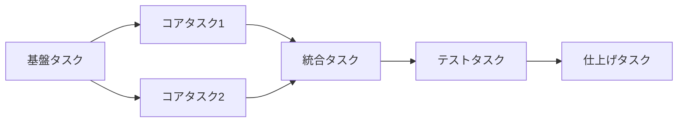

# Task Breakdown - タスク分解

技術設計書（`*_design.md`）を読み込み、独立してテスト可能な小タスクに分解します。

## 前提条件

**sdd-workflow エージェントの原則に従ってタスク分解を行います。**

### Tasks フェーズの位置づけ（参照）

| フェーズ | 目的 | 成果物 |
|:---|:---|:---|
| **Tasks** | 設計を独立してテスト可能な小タスクに分解 | `review/` 配下 |

## 入力

$ARGUMENTS

### 入力例

```
/task_breakdown user-auth
/task_breakdown task-management TICKET-123
```

## 処理フロー

### 1. 関連ドキュメントの読み込み

```
.docs/requirement-diagram/{機能名}.md を読み込む（PRD、存在する場合）
.docs/specification/{機能名}_spec.md を読み込む（存在する場合）
.docs/specification/{機能名}_design.md を読み込む（必須）
```

- 設計書が存在しない場合は、先に `/generate_spec` で作成を促す
- PRD/specが存在する場合は、タスクが要求をカバーしているか確認に使用

### 2. 設計書の分析

設計書から以下の情報を抽出：

| 抽出項目 | 説明 |
|:---|:---|
| **モジュール構成** | 作成するファイル・ディレクトリ |
| **依存関係** | モジュール間の依存 |
| **インターフェース** | 各モジュールの公開API |
| **技術スタック** | 使用するライブラリ・フレームワーク |

### 3. タスク分解の原則

#### 独立性（Independence）

- 各タスクは他のタスクに依存せずに実装可能
- 並行して作業可能な粒度に分解

#### テスト可能性（Testability）

- 各タスクは単独でテスト可能
- 完了条件が明確

#### 適切な粒度（Granularity）

- 1タスク = 数時間〜1日程度で完了可能
- 大きすぎず、小さすぎない

### 4. タスクの分類

| カテゴリ | 説明 | 例 |
|:---|:---|:---|
| **基盤** | 他のタスクの前提となる作業 | ディレクトリ構成、型定義 |
| **コア** | 主要な機能実装 | ビジネスロジック、API |
| **統合** | モジュール間の連携 | サービス層、イベント処理 |
| **テスト** | テストの作成 | 単体テスト、統合テスト |
| **仕上げ** | 最終調整 | ドキュメント更新、リファクタリング |

### 5. 依存関係の整理

タスク間の依存関係を明確化：



## 出力フォーマット

### タスクリスト

```markdown
# {機能名} タスク分解

## メタ情報

| 項目 | 内容 |
|:---|:---|
| 機能名 | {機能名} |
| チケット番号 | {チケット番号}（指定がある場合） |
| 設計書 | `.docs/specification/{機能名}_design.md` |
| 作成日 | YYYY-MM-DD |

## タスク一覧

### Phase 1: 基盤

| # | タスク | 説明 | 完了条件 | 依存 |
|:---|:---|:---|:---|:---|
| 1.1 | {タスク名} | {詳細説明} | {完了条件} | - |
| 1.2 | {タスク名} | {詳細説明} | {完了条件} | 1.1 |

### Phase 2: コア実装

| # | タスク | 説明 | 完了条件 | 依存 |
|:---|:---|:---|:---|:---|
| 2.1 | {タスク名} | {詳細説明} | {完了条件} | 1.x |
| 2.2 | {タスク名} | {詳細説明} | {完了条件} | 1.x |

### Phase 3: 統合

| # | タスク | 説明 | 完了条件 | 依存 |
|:---|:---|:---|:---|:---|
| 3.1 | {タスク名} | {詳細説明} | {完了条件} | 2.x |

### Phase 4: テスト

| # | タスク | 説明 | 完了条件 | 依存 |
|:---|:---|:---|:---|:---|
| 4.1 | {タスク名} | {詳細説明} | {完了条件} | 3.x |

### Phase 5: 仕上げ

| # | タスク | 説明 | 完了条件 | 依存 |
|:---|:---|:---|:---|:---|
| 5.1 | {タスク名} | {詳細説明} | {完了条件} | 4.x |

## 依存関係図

```mermaid
graph TD
    subgraph "Phase 1: 基盤"
        T1_1[1.1 {タスク名}]
        T1_2[1.2 {タスク名}]
    end

    subgraph "Phase 2: コア"
        T2_1[2.1 {タスク名}]
        T2_2[2.2 {タスク名}]
    end

    T1_1 --> T1_2
    T1_2 --> T2_1
    T1_2 --> T2_2
```

## 実装の注意事項

- {注意事項1}
- {注意事項2}

## 参照ドキュメント

- 抽象仕様書: `.docs/specification/{機能名}_spec.md`
- 技術設計書: `.docs/specification/{機能名}_design.md`
```

**保存先**: `.docs/review/{チケット番号}/tasks.md` または `.docs/review/{機能名}/tasks.md`

## 要求カバレッジの確認

PRD/specが存在する場合、生成したタスクリストに対して以下を確認してください：

### チェック項目

| チェック項目       | 確認内容                                |
|:-------------|:------------------------------------|
| **機能要求の網羅性** | PRD/specの機能要求（FR-xxx）がタスクでカバーされているか |
| **非機能要求の考慮** | 非機能要求（NFR-xxx）がテストタスクに含まれているか       |
| **API実装の網羅性** | specのAPIがすべてコアタスクに含まれているか           |

### 要求カバレッジ表の出力

タスクリストの末尾に以下を追記（PRD/specが存在する場合）：

```markdown
## 要求カバレッジ

| 要求ID   | 要求内容     | 対応タスク     |
|:-------|:---------|:----------|
| FR-001 | {要求内容}   | 2.1, 2.2  |
| FR-002 | {要求内容}   | 2.3       |
| NFR-001 | {要求内容}  | 4.1       |
```

### カバレッジ不足時の対応

- カバーされていない要求がある場合、タスクを追加
- タスクに対応する要求がない場合、スコープ外の可能性を確認

## 生成後のアクション

1. **ファイル保存**:
   - `.docs/review/{対象}/tasks.md`

2. **要求カバレッジ確認**:
   - PRD/specが存在する場合: すべての要求がタスクでカバーされているか確認
   - カバレッジ表をタスクリストに追記

3. **コミット**:
   - `[docs] {機能名}のタスク分解を作成`

4. **次のステップ**:
   - Phase 1 の基盤タスクから順に実装開始
   - 各タスク完了時にチェックを入れる
   - 全タスク完了後、`/review_cleanup` で整理

## 注意事項

- 設計書がない状態でのタスク分解は避ける
- タスクが大きすぎる場合は、さらに分解を検討
- 依存関係を無視した実装順序は避ける
- 完了条件は具体的かつ検証可能にする
