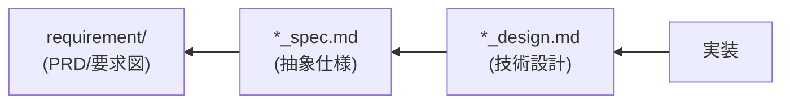

# Doc Consistency Checker - ドキュメント整合性チェック

AI-SDD ドキュメント間（PRD、`*_spec.md`、`*_design.md`）の整合性を自動チェックし、不整合を検出します。

## 前提条件

**実行前に必ず `sdd-workflow-ja:sdd-workflow` エージェントの内容を読み込み、AI-SDDの原則を理解してください。**

このスキルはsdd-workflowエージェントの原則に従ってドキュメント整合性をチェックします。

### 設定ファイルの確認

**実行時にプロジェクトルートの `.sdd-config.json` を確認し、存在する場合は設定値を使用してディレクトリパスを解決します。**

設定ファイルの詳細は `sdd-workflow-ja:sdd-workflow` エージェントの「プロジェクト設定ファイル」セクションを参照してください。

以下のドキュメントでは、デフォルト値（`.sdd`、`requirement`、`specification`）を使用して説明しますが、設定ファイルが存在する場合はカスタム値に置き換えてください。

## ドキュメント間の依存関係



**依存方向の意味**:

- `実装` は `*_design.md` を参照して作成される
- `*_design.md` は `*_spec.md` を参照して作成される
- `*_spec.md` は `requirement` を参照して作成される

## ディレクトリ構造のサポート

フラット構造と階層構造の両方をサポートします。

**フラット構造**:

```
.sdd/
├── requirement/{機能名}.md
└── specification/
    ├── {機能名}_spec.md
    └── {機能名}_design.md
```

**階層構造**:

```
.sdd/
├── requirement/
│   ├── {機能名}.md                    # トップレベル機能
│   └── {親機能名}/
│       ├── index.md                   # 親機能の概要・要求一覧
│       └── {子機能名}.md              # 子機能の要求仕様
└── specification/
    ├── {機能名}_spec.md               # トップレベル機能
    ├── {機能名}_design.md
    └── {親機能名}/
        ├── index_spec.md              # 親機能の抽象仕様書
        ├── index_design.md            # 親機能の技術設計書
        ├── {子機能名}_spec.md         # 子機能の抽象仕様書
        └── {子機能名}_design.md       # 子機能の技術設計書
```

整合性チェックでは、階層構造の場合も親子関係を考慮してチェックを行います。

## チェック項目

### 1. PRD ↔ spec の整合性

| チェック項目       | 説明                      |
|:-------------|:------------------------|
| **要求IDの対応**  | PRDの要求IDがspecで参照されているか  |
| **機能要求の網羅性** | PRDの機能要求がspecでカバーされているか |
| **非機能要求の反映** | PRDの非機能要求がspecに反映されているか |
| **用語の一致**    | PRDとspecで同じ用語が使用されているか  |

### 2. spec ↔ design の整合性

| チェック項目          | 説明                           |
|:----------------|:-----------------------------|
| **API定義の一致**    | specのAPIがdesignで詳細化されているか    |
| **データモデルの一致**   | specの型定義がdesignと一致するか        |
| **要求の設計判断への反映** | specの要件がdesignの設計判断に反映されているか |
| **制約事項の考慮**     | specの制約がdesignで考慮されているか      |

### 3. design ↔ 実装の整合性

| チェック項目            | 説明                            |
|:------------------|:------------------------------|
| **モジュール構成の一致**    | designのモジュール構成と実際のディレクトリ構造    |
| **インターフェース定義の一致** | designの定義と実装コードの一致            |
| **技術スタックの一致**     | designに記載されたライブラリが実際に使用されているか |

## 自動検出パターン

### 不整合の検出

1. **欠落**: 上流ドキュメントに存在するが下流に反映されていない
2. **矛盾**: 上流と下流で異なる内容が記載されている
3. **陳腐化**: 下流の変更が上流に反映されていない

### 検出方法

```
1. 対象ドキュメントを読み込む
   ↓
2. 以下の要素を抽出:
   - 要求ID（PRD）
   - API定義（spec）
   - 型定義（spec, design）
   - モジュール構成（design）
   ↓
3. ドキュメント間で照合
   ↓
4. 不整合を検出・分類
```

## 出力フォーマット

整合性チェック結果の出力には [templates/consistency_report.md](templates/consistency_report.md) を使用してください。

## チェック実行タイミング

| タイミング       | 推奨チェック             |
|:------------|:-------------------|
| **タスク開始時**  | 既存ドキュメントの存在確認と整合性  |
| **Plan完了時** | spec ↔ design の整合性 |
| **実装完了時**   | design ↔ 実装 の整合性   |
| **レビュー時**   | 全ドキュメント間の整合性       |
| **定期チェック**  | ドキュメントの陳腐化防止       |

## ドキュメント更新トリガー

整合性チェックの結果、以下の場合はドキュメント更新を推奨：

### `*_spec.md` を更新すべき場合

- 公開APIのシグネチャ変更（引数、戻り値、型）
- 新しいデータモデルの追加
- 既存の振る舞いの根本的な変更
- 要求図で新しい要求が追加された場合

### `*_design.md` を更新すべき場合

- 技術スタックの変更（ライブラリ追加・変更など）
- アーキテクチャ上の重要な判断
- モジュール構成の変更
- 新しい設計パターンの導入

### 更新不要な場合

- 内部実装の最適化（インターフェース変更なし）
- バグ修正（仕様からの逸脱を修正）
- リファクタリング（動作変更なし）

## 注意事項

- このスキルは**検出と報告**を行い、自動修正は行わない
- 不整合の解消は開発者の判断に委ねる
- 上流ドキュメントを優先（PRD > spec > design）
- 実装が正しく仕様が古い場合もあるため、一律に仕様を正とはしない
