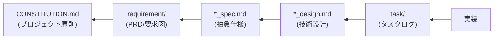

# SDD Templates - AI-SDDドキュメントテンプレート（フォールバック用）

AI-SDD ワークフローで使用する各種ドキュメントのテンプレートを提供します。

## 重要: テンプレート選択の手順

**このスキルのテンプレートはフォールバック用です。必ず以下の手順に従ってください。**

### 必須の確認手順

ドキュメント生成時は、**必ず以下の順序で**テンプレートを探索してください：

```
1. プロジェクトファイル/テンプレートを確認（最優先）
   ├─ .sdd/CONSTITUTION.md が存在するか？
   ├─ .sdd/PRD_TEMPLATE.md が存在するか？
   ├─ .sdd/SPECIFICATION_TEMPLATE.md が存在するか？
   └─ .sdd/DESIGN_DOC_TEMPLATE.md が存在するか？
   ↓
2. プロジェクトファイル/テンプレートが存在する場合
   → そのファイルを使用（このスキルのテンプレートは使用しない）
   ↓
3. プロジェクトファイル/テンプレートが存在しない場合のみ
   → このスキルのテンプレートを使用してプロジェクト用ファイルを生成
```

### テンプレート優先順位（厳守）

| 優先度            | テンプレート       | パス                  | 使用条件                   |
|:---------------|:-------------|:--------------------|:-----------------------|
| **1（最優先）**     | プロジェクトテンプレート | `.sdd/*.md`         | 存在すれば必ず使用              |
| **2（フォールバック）** | プラグインテンプレート  | このスキルの `templates/` | プロジェクトテンプレートが存在しない場合のみ |

## 前提条件

**実行前に必ず `sdd-workflow-ja:sdd-workflow` エージェントの内容を読み込み、AI-SDDの原則を理解してください。**

このスキルはsdd-workflowエージェントの原則に従ったテンプレートを提供します。

### ディレクトリパスの解決

**環境変数 `SDD_*` を使用してディレクトリパスを解決します。**

| 環境変数                     | デフォルト値               | 説明              |
|:-------------------------|:---------------------|:----------------|
| `SDD_ROOT`               | `.sdd`               | ルートディレクトリ       |
| `SDD_REQUIREMENT_PATH`   | `.sdd/requirement`   | PRD/要求仕様書ディレクトリ |
| `SDD_SPECIFICATION_PATH` | `.sdd/specification` | 仕様書・設計書ディレクトリ   |
| `SDD_TASK_PATH`          | `.sdd/task`          | タスクログディレクトリ     |

**パス解決の優先順位:**

1. 環境変数 `SDD_*` が設定されている場合はそれを使用
2. 環境変数がない場合は `.sdd-config.json` を確認
3. どちらもない場合はデフォルト値を使用

テンプレート生成時、設定に基づいてテンプレート内のパスを調整してください。

## フォールバックテンプレート一覧

プロジェクトにテンプレートが存在しない場合に使用：

| テンプレート         | ファイル                                                                                 | 対応するプロジェクトテンプレート                 |
|:---------------|:-------------------------------------------------------------------------------------|:---------------------------------|
| **PRD（要求仕様書）** | [templates/prd_template.md](templates/prd_template.md)                               | `.sdd/PRD_TEMPLATE.md`           |
| **抽象仕様書**      | [templates/spec_template.md](templates/spec_template.md)                             | `.sdd/SPECIFICATION_TEMPLATE.md` |
| **技術設計書**      | [templates/design_template.md](templates/design_template.md)                         | `.sdd/DESIGN_DOC_TEMPLATE.md`    |
| **品質チェックリスト**  | [templates/checklist_template.md](templates/checklist_template.md)                   | N/A（コマンドから動的生成）                  |
| **プロジェクト原則**   | [templates/constitution_template.md](templates/constitution_template.md)             | `.sdd/CONSTITUTION.md`           |
| **実装ログ**       | [templates/implementation_log_template.md](templates/implementation_log_template.md) | N/A（実装中に動的生成）                    |

## 使用方法

### ケース1: プロジェクト原則の生成（/sdd_init または /constitution init）

```
/sdd_init
または
/constitution init

1. .sdd/CONSTITUTION.md を確認
2. 存在する → スキップ（既存の原則を尊重）
3. 存在しない:
   - このスキルの templates/constitution_template.md を参照
   - プロジェクトコンテキスト（言語、フレームワーク、ドメイン）を分析
   - カスタマイズされた原則を .sdd/CONSTITUTION.md に生成
```

### ケース2: プロジェクトテンプレートが存在する場合

```
/generate_spec {仕様内容}

1. .sdd/SPECIFICATION_TEMPLATE.md を確認
2. 存在する → そのテンプレートを使用
3. このスキルのテンプレートは参照しない
```

### ケース3: プロジェクトテンプレートが存在しない場合

```
/generate_spec {仕様内容}

1. .sdd/SPECIFICATION_TEMPLATE.md を確認
2. 存在しない → このスキルのテンプレートを使用
3. プロジェクトの言語・構成に合わせてカスタマイズして生成
4. 生成後、.sdd/ にプロジェクト用テンプレートとして保存を推奨
```

### プロジェクトテンプレートの初期化

プロジェクトにテンプレートがない場合、以下の手順で初期化できます：

1. `/sdd_init` コマンドを実行（推奨）
2. または、このスキルのテンプレートを `.sdd/` に手動コピー
3. プロジェクトのプログラミング言語に合わせて型定義の記法を修正
4. プロジェクトのディレクトリ構成に合わせてパスを修正
5. 以後、プロジェクトファイル/テンプレートが優先される

## テンプレートの概要

### PRD（要求仕様書）テンプレート

SysML要求図形式で以下を定義：

- 背景と目的
- ユーザ要求（UR-xxx）
- 機能要求（FR-xxx）
- 非機能要求（NFR-xxx）
- 要求図（Mermaid）
- 制約事項・前提条件

### 抽象仕様書テンプレート

システムの論理構造を定義：

- 背景・概要
- 機能要件（PRD要求IDとの対応）
- 公開API（SysML bdd形式）
- データモデル
- 振る舞い（シーケンス図）

### 技術設計書テンプレート

具体的な実装計画を定義：

- 実装ステータス
- 設計目標
- 技術スタック
- アーキテクチャ
- 設計判断と根拠

### 品質チェックリストテンプレート

仕様書・設計書から自動生成されるチェックリスト：

- 要求レビュー
- API仕様
- データモデル
- 設計レビュー
- 単体テスト
- 統合テスト
- パフォーマンス
- セキュリティ
- デプロイ

### プロジェクト原則テンプレート

プロジェクトの非交渉原則を定義：

- ビジネス原則
- アーキテクチャ原則
- 開発手法原則
- 技術制約
- セマンティックバージョニング

### 実装ログテンプレート

実装中の判断や問題を記録：

- 実装判断
- 問題と解決策
- 代替案の検討
- 技術的発見
- テスト結果
- パフォーマンス計測

## ドキュメント間の依存関係



各テンプレートは、この依存関係に基づいてトレーサビリティを確保するよう設計されています。

**CONSTITUTION.md が最上位**: すべてのドキュメントはプロジェクト原則に従って作成されます。

## 注意事項

- テンプレートは**構造のガイドライン**であり、すべてのセクションが必須ではありません
- プロジェクトの規模・性質に応じて必要なセクションを選択してください
- 要求ID（UR-xxx, FR-xxx, NFR-xxx）は一意に管理し、ドキュメント間で参照可能にしてください
