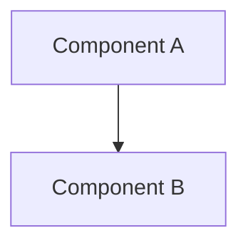

# 技術設計書テンプレート (Design Doc)

このドキュメントは `.sdd/specification/` 配下の技術設計書（Design Doc）を作成する際のテンプレートです。
ファイル名は `{機能名}_design.md` となります。

> **注意**: このテンプレートはプラグインのフォールバック用です。
> プロジェクトで使用する際は、プログラミング言語やプロジェクト構成に合わせてカスタマイズし、
> `.sdd/DESIGN_DOC_TEMPLATE.md` として保存してください。

## 抽象仕様書との違い

| ドキュメント          | SDDフェーズ          | 役割と焦点                                               | 抽象度      |
|-----------------|------------------|-----------------------------------------------------|----------|
| `xxx_spec.md`   | **Specify（仕様化）** | **「何を作るか」「なぜ作るか」** - システムの抽象的な構造と振る舞いを定義。技術的詳細は含めない | 高（抽象的）   |
| `xxx_design.md` | **Plan（計画/設計）**  | **「どのように実現するか」** - 抽象仕様を実現するための具体的な技術設計。設計判断の透明性を確保 | 中〜低（具体的） |

---

# {機能名} `<MUST>`

**ドキュメント種別:** 技術設計書 (Design Doc)
**SDDフェーズ:** Plan (計画/設計)
**最終更新日:** YYYY-MM-DD
**関連 Spec:** [xxx_spec.md へのリンク]
**関連 PRD:** [requirement/{機能名}.md へのリンク]

---

# 1. 実装ステータス `<MUST>`

**ステータス:** 🟢 実装済み / 🟡 部分実装 / 🔴 未実装

## 1.1. 実装進捗 `<OPTIONAL>`

| モジュール/機能 | ステータス    | 備考   |
|----------|----------|------|
| [モジュール]  | 🟢/🟡/🔴 | [備考] |

---

# 2. 設計目標 `<MUST>`

本設計が達成すべき主要な技術目標を記述します。

---

# 3. 技術スタック `<MUST>`

**なぜその技術を選んだのか** という判断の根拠を明確に残します。

| 領域   | 採用技術 | 選定理由 |
|------|------|------|
| [領域] | [技術] | [理由] |

---

# 4. アーキテクチャ `<MUST>`

## 4.1. システム構成図



## 4.2. モジュール分割

| モジュール名 | 責務   | 依存関係 | 配置場所 |
|--------|------|------|------|
| [名前]   | [責務] | [依存] | [パス] |

---

# 5. データモデル `<OPTIONAL>`

<!--
プロジェクトのプログラミング言語に合わせて記法を変更してください。
例: TypeScript, Go, Python, Kotlin など
-->

```
// プロジェクトの言語に合わせたデータモデルを記載
interface SomeEntity {
  id: string
  name: string
}
```

---

# 6. インターフェース定義 `<OPTIONAL>`

<!--
プロジェクトのプログラミング言語に合わせて記法を変更してください。
-->

```
// プロジェクトの言語に合わせたインターフェース定義を記載
interface SomeRepository {
  fetch(): Promise<Data>
}
```

---

# 7. 非機能要件実現方針 `<OPTIONAL>`

| 要件   | 実現方針 |
|------|------|
| [要件] | [方針] |

---

# 8. テスト戦略 `<OPTIONAL>`

| テストレベル | 対象   | カバレッジ目標 |
|--------|------|---------|
| [レベル]  | [対象] | [目標]    |

---

# 9. 設計判断 `<MUST>`

## 9.1. 決定事項

| 決定事項 | 選択肢 | 決定内容 | 理由   |
|------|-----|------|------|
| [事項] | [肢] | [決定] | [理由] |

## 9.2. 未解決の課題 `<OPTIONAL>`

| 課題   | 影響度 | 対応方針 |
|------|-----|------|
| [課題] | [度] | [方針] |

---

# 10. 変更履歴 `<OPTIONAL>`

## vX.X

**変更内容:**

- 変更1

**移行ガイド:**

<!--
プロジェクトのプログラミング言語に合わせて記法を変更してください。
-->

```
// ❌ 旧コード
// ✅ 新コード
```

---

# セクション必須度の凡例

| マーク             | 意味 | 説明                   |
|-----------------|----|----------------------|
| `<MUST>`        | 必須 | すべての技術設計書で必ず記載してください |
| `<RECOMMENDED>` | 推奨 | 可能な限り記載することを推奨します    |
| `<OPTIONAL>`    | 任意 | 必要に応じて記載してください       |

---

# ガイドライン

## 含めるべき内容

- ✅ 実装ステータス・進捗
- ✅ 技術スタックの選定理由
- ✅ アーキテクチャ・モジュール構成
- ✅ 実装パターン・デザインパターンの適用
- ✅ ディレクトリ構造・ファイル配置
- ✅ テスト戦略・カバレッジ目標
- ✅ 設計判断の記録
- ✅ 変更履歴・移行ガイド

## 含めないべき内容（→ Spec へ）

- ❌ 機能の目的と背景
- ❌ ユーザーストーリー・ユースケース
- ❌ 公開API（インターフェース）の定義
- ❌ データモデルの論理構造
- ❌ 振る舞いの抽象的な記述
- ❌ 機能要件・非機能要件
- ❌ 用語集

---

# プロジェクトへのカスタマイズ指針

このテンプレートをプロジェクト用にカスタマイズする際は、以下の項目を更新してください：

1. **データモデルの記法**: プロジェクトのプログラミング言語に合わせる
2. **インターフェース定義の記法**: プロジェクトのプログラミング言語に合わせる
3. **変更履歴のコード例**: プロジェクトのプログラミング言語に合わせる
4. **モジュール分割表のカラム**: プロジェクトの構成（パッケージ/モジュール構造）に合わせる
5. **技術スタック表**: プロジェクトで使用する技術領域に合わせる

---

**この Design Docは、AIエージェントが実装（Implement）フェーズで参照する、具体的なコード生成のための指針となります。**
