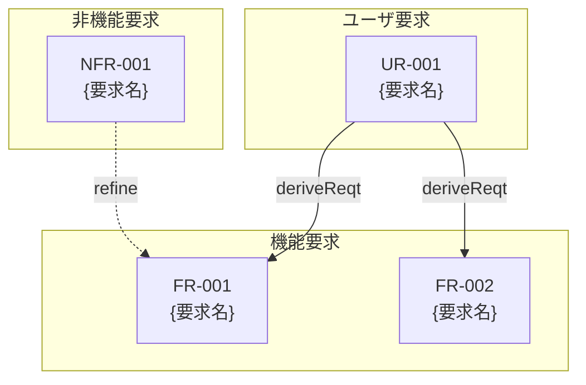

# PRD（要求仕様書）テンプレート

このドキュメントは `.docs/requirement-diagram/` 配下のPRD（要求仕様書）を作成する際のテンプレートです。
ファイル名は `{機能名}.md` となります。

> **注意**: このテンプレートはプラグインのフォールバック用です。
> プロジェクトで使用する際は、プロジェクト構成に合わせてカスタマイズし、
> `.docs/PRD_TEMPLATE.md` として保存してください。

## 仕様書・設計書との違い

| ドキュメント                     | SDDフェーズ          | 役割と焦点                                               | 抽象度      |
|----------------------------|------------------|-----------------------------------------------------|----------|
| `requirement-diagram/*.md` | **Specify（仕様化）** | **「何を作るか」「なぜ作るか」** - ビジネス要求を定義。技術詳細は含めない            | 最高（抽象的）  |
| `xxx_spec.md`              | **Specify（仕様化）** | **「何を作るか」** - システムの抽象的な構造と振る舞いを定義。技術的詳細は含めない        | 高（抽象的）   |
| `xxx_design.md`            | **Plan（計画/設計）**  | **「どのように実現するか」** - 抽象仕様を実現するための具体的な技術設計。設計判断の透明性を確保 | 中〜低（具体的） |

---

# {機能名} 要求仕様書 (PRD) `<MUST>`

**ドキュメント種別:** PRD (要求仕様書)
**SDDフェーズ:** Specify (仕様化) - 最上流
**最終更新日:** YYYY-MM-DD
**ステータス:** Draft / Review / Approved
**関連 Spec:** [xxx_spec.md へのリンク]
**関連 Design Doc:** [xxx_design.md へのリンク]

---

# 1. 背景と目的 `<MUST>`

## 1.1. 背景

なぜこの機能が必要なのか、現状の課題を説明します。

## 1.2. 目的

この機能で達成したいこと、ビジネス価値を説明します。

## 1.3. 成功基準 `<RECOMMENDED>`

- 定量的または定性的な成功指標

---

# 2. 要求定義 `<MUST>`

## 2.1. ユーザ要求（User Requirements）

ユーザーの視点からの要求を定義します。

| ID     | 要求            | 優先度                   | 検証方法   |
|--------|---------------|-----------------------|--------|
| UR-001 | [ユーザーが〜できること] | Must / Should / Could | [検証方法] |

## 2.2. 機能要求（Functional Requirements）

システムが提供すべき機能を定義します。

| ID     | 要求           | 派生元    | 優先度                   | 検証方法   |
|--------|--------------|--------|-----------------------|--------|
| FR-001 | [システムが〜すること] | UR-001 | Must / Should / Could | [検証方法] |

## 2.3. 非機能要求（Non-Functional Requirements） `<OPTIONAL>`

| ID      | カテゴリ    | 要求        | 優先度                   | 検証方法   |
|---------|---------|-----------|-----------------------|--------|
| NFR-001 | パフォーマンス | [応答時間など]  | Must / Should / Could | [検証方法] |
| NFR-002 | セキュリティ  | [認証・認可など] | Must / Should / Could | [検証方法] |

---

# 3. 要求図（SysML Requirements Diagram） `<RECOMMENDED>`

## 3.1. 要求関係の凡例

| 関係         | 意味                | 表記   |
|------------|-------------------|------|
| deriveReqt | 派生（上位要求から下位要求を導出） | 実線矢印 |
| refine     | 詳細化（抽象的な要求を具体化）   | 点線矢印 |
| satisfy    | 充足（設計要素が要求を満たす）   | -    |
| verify     | 検証（テストケースが要求を検証）  | -    |
| trace      | トレース（要求間の一般的な関連）  | -    |

---

# 4. 制約事項 `<OPTIONAL>`

## 4.1. 技術的制約

- 技術的な制約

## 4.2. ビジネス的制約

- ビジネス的な制約（スケジュール、予算など）

---

# 5. 前提条件 `<OPTIONAL>`

- この機能が動作するための前提
- 依存する他システム・機能

---

# 6. スコープ外 `<OPTIONAL>`

以下は本PRDのスコープ外とします：

- この機能に含まれないこと
- 将来的に検討する可能性があるが、今回は対象外

---

# 7. 用語集 `<OPTIONAL>`

| 用語   | 定義   |
|------|------|
| [用語] | [定義] |

---

# セクション必須度の凡例

| マーク             | 意味 | 説明                 |
|-----------------|----|--------------------|
| `<MUST>`        | 必須 | すべてのPRDで必ず記載してください |
| `<RECOMMENDED>` | 推奨 | 可能な限り記載することを推奨します  |
| `<OPTIONAL>`    | 任意 | 必要に応じて記載してください     |

---

# ガイドライン

## 含めるべき内容

- ✅ ビジネス要求と背景
- ✅ ユーザ要求（UR-xxx）
- ✅ 機能要求（FR-xxx）
- ✅ 非機能要求（NFR-xxx）
- ✅ 要求間の関係（派生、詳細化）
- ✅ 制約事項・前提条件
- ✅ スコープ外の明示

## 含めないべき内容（→ Spec / Design Doc へ）

- ❌ 技術的な実装詳細
- ❌ アーキテクチャ・モジュール構成
- ❌ 技術スタックの選定
- ❌ API定義・型定義
- ❌ データベーススキーマ

---

# プロジェクトへのカスタマイズ指針

このテンプレートをプロジェクト用にカスタマイズする際は、以下の項目を更新してください：

1. **要求IDの命名規則**: プロジェクトの規約に合わせる（UR/FR/NFR以外のプレフィックスを使う場合）
2. **優先度の分類**: プロジェクトの優先度分類方法に合わせる（MoSCoW法以外を使う場合）
3. **関連ドキュメントのリンク形式**: プロジェクトのドキュメント管理方法に合わせる
4. **非機能要求のカテゴリ**: プロジェクトで重視する品質特性に合わせる

---

**このPRDは、AIエージェントが仕様化（Specify）フェーズで参照する、ビジネス要求の真実の源となります。**
