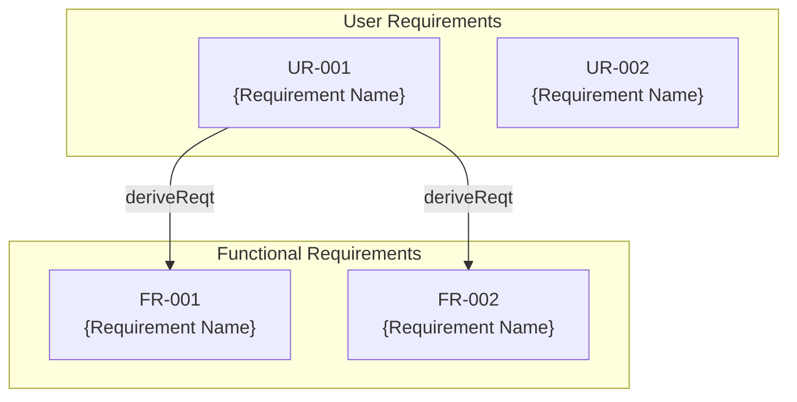

# Generate PRD - Requirements Specification Generation

Generates PRD (Requirements Specification) from input business requirements according to the AI-SDD workflow.

## Prerequisites

**Before execution, you must read `sdd-workflow:sdd-workflow` agent content to understand AI-SDD principles.**

This command follows the sdd-workflow agent principles for PRD generation.

### PRD / Requirements Diagram Positioning (Reference)

**Abstraction Level: Highest** | **Focus: What to build, why to build it**

| Item | Details |
|:---|:---|
| **Purpose** | Define high-level product requirements (business value) |
| **Content** | User requirements, functional requirements, non-functional requirements in SysML requirements diagram format |
| **Technical Details** | **Not included** |
| **SysML Elements** | Requirements Diagram (req) |

### Document Dependencies

```
PRD (Requirements Diagram) ← *_spec.md ← *_design.md ← Implementation
```

PRD is the most upstream document and serves as the foundation for subsequent specifications and design documents.

## Input

$ARGUMENTS

### Input Examples

```
/generate_prd A feature for users to manage tasks.
Available only to logged-in users.
Supports task creation, editing, deletion, and completion, with due date and priority settings.
Sends email notifications for tasks nearing their due date.
```

## Generation Rules

### 1. Vibe Coding Risk Assessment (Perform First)

Analyze input content and assess risk based on the following criteria:

| Risk | Condition | Response |
|:---|:---|:---|
| High | Business requirements vague | Confirm missing info with user before generating |
| Medium | Some requirements unclear | Clarify ambiguous points before generating |
| Low | Requirements clear | Can generate as-is |

**Examples of Vague Input**:

- "Add a useful feature" → Confirm specific functionality
- "Improve user experience" → Confirm improvement target and goals
- "Same feature as competitors" → Confirm specific feature specifications

### 2. Input Content Analysis

Extract/infer the following from input:

| Extraction Item | Description | Required |
|:---|:---|:---|
| **Feature Name** | Identifier used for filename | Yes |
| **Background/Purpose** | Why this feature is needed, business value | Yes |
| **User Requirements** | What end users want | Yes |
| **Functional Requirements** | Functions the system should provide | Yes |
| **Non-Functional Requirements** | Performance, security, availability, etc. | |
| **Constraints** | Technical/business constraints | |
| **Preconditions** | Assumptions for feature operation | |

### 3. Missing Information Confirmation

If important items cannot be determined from input, **confirm with user before generation**:

- Feature name unclear
- Business value/purpose unclear
- User requirements subject (who will use it) unclear
- Success criteria/goals unclear

### 4. Existing Document Check

Check the following before generation:

```
Does .docs/requirement-diagram/{feature-name}.md already exist? (PRD)
Does .docs/specification/{feature-name}_spec.md already exist? (spec)
Does .docs/specification/{feature-name}_design.md already exist? (design)
```

**If PRD exists**: Confirm with user whether to overwrite.

**If spec/design exists**:
- After PRD generation, verify no impact on consistency with existing spec/design
- If requirement IDs are added/changed, notify that spec/design may need updates

## Output Format

### PRD in SysML Requirements Diagram Format

```markdown
# {Feature Name} Requirements Specification (PRD)

## Document Information

| Item | Content |
|:---|:---|
| Feature Name | {Feature Name} |
| Created Date | YYYY-MM-DD |
| Status | Draft / Review / Approved |

## Background and Purpose

### Background

{Why this feature is needed, current issues}

### Purpose

{What to achieve with this feature, business value}

### Success Criteria

- {Quantitative or qualitative success metrics}

## Requirements Definition

### User Requirements

Define requirements from user perspective.

| ID | Requirement | Priority |
|:---|:---|:---|
| UR-001 | {User can do X} | Must / Should / Could |
| UR-002 | {User can do Y} | Must / Should / Could |

### Functional Requirements

Define functions the system should provide.

| ID | Requirement | Derived From | Priority |
|:---|:---|:---|:---|
| FR-001 | {System does X} | UR-001 | Must / Should / Could |
| FR-002 | {System does Y} | UR-001 | Must / Should / Could |

### Non-Functional Requirements

| ID | Category | Requirement | Priority |
|:---|:---|:---|:---|
| NFR-001 | Performance | {Response time, throughput, etc.} | Must / Should / Could |
| NFR-002 | Security | {Authentication, authorization, encryption, etc.} | Must / Should / Could |
| NFR-003 | Availability | {Uptime, disaster recovery, etc.} | Must / Should / Could |

## Requirements Diagram (SysML Requirements Diagram)



## Constraints

- {Technical constraints}
- {Business constraints}
- {Legal/regulatory constraints}

## Preconditions

- {Assumptions for this feature to operate}
- {Dependent systems/features}

## Out of Scope

- {What is not included in this feature}
- {May be considered in future but out of scope for now}

## Glossary

| Term | Definition |
|:---|:---|
| {Term 1} | {Definition} |
| {Term 2} | {Definition}|

```

**Save Location**: `.docs/requirement-diagram/{feature-name}.md`

## Generation Flow

```
1. Analyze input content
   ↓
2. Vibe Coding risk assessment
   ├─ High: Confirm missing info with user → Resume after response
   ├─ Medium: Confirm ambiguous points → Resume after response
   └─ Low: Proceed to next step
   ↓
3. Check existing documents
   ├─ If PRD exists: Confirm overwrite
   └─ If spec/design exists: Understand impact scope
   ↓
4. Generate and save PRD
   ↓
5. Check consistency with existing spec/design (if they exist)
   ├─ Consistent: Proceed to next step
   └─ Updates needed: Notify recommendation to update spec/design
   ↓
6. Propose next steps
   - Create abstract specification with /generate_spec
   - If existing spec exists, recommend update
```

## Consistency Check with Existing spec/design

If existing spec/design exists, verify the following after PRD generation:

### Check Items

| Check Item | Verification Content |
|:---|:---|
| **New Requirement Addition** | Are requirements added in PRD reflected in spec? |
| **Requirement Changes** | Are requirements changed in PRD reflected in spec/design? |
| **Requirement Deletion** | Are requirements deleted from PRD removed from spec/design? |
| **Requirement ID Consistency** | Do requirement ID references in spec match PRD? |

### Handling When Updates Needed

1. **Spec needs update**: Regenerate with `/generate_spec` or update manually
2. **Design needs update**: Check if spec changes require design decision revision
3. **Impact Scope Notification**: Clearly indicate to user which documents need updates

## Post-Generation Actions

1. **Save File**:
   - `.docs/requirement-diagram/{feature-name}.md`

2. **Consistency Check**:
   - If existing spec/design exists: Verify impact and notify if updates needed

3. **Commit**:
   - `[docs] Add {feature-name} PRD`

4. **Next Steps**:
   - Create abstract specification and technical design document with `/generate_spec`
   - Reference PRD requirement IDs in specification
   - If existing spec exists, recommend update

## Notes

- PRD should **NOT include technical details** (that is the role of `*_spec.md` and `*_design.md`)
- Manage requirement IDs uniquely so they can be referenced in subsequent documents
- Classify priorities using MoSCoW method (Must/Should/Could/Won't)
- Maintain high abstraction level and focus on "what" and "why"
