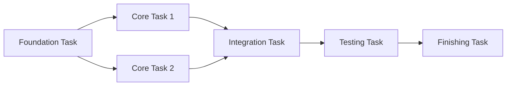

# Task Breakdown

Loads technical design document (`*_design.md`) and breaks it down into independently testable small tasks.

## Prerequisites

**Before execution, you must read `sdd-workflow:sdd-workflow` agent content to understand AI-SDD principles.**

This command follows the sdd-workflow agent principles for task breakdown.

### Directory Path Resolution

**Use `SDD_*` environment variables to resolve directory paths.**

| Environment Variable     | Default Value        | Description                    |
|:-------------------------|:---------------------|:-------------------------------|
| `SDD_ROOT`               | `.sdd`               | Root directory                 |
| `SDD_REQUIREMENT_PATH`   | `.sdd/requirement`   | PRD/Requirements directory     |
| `SDD_SPECIFICATION_PATH` | `.sdd/specification` | Specification/Design directory |
| `SDD_TASK_PATH`          | `.sdd/task`          | Task log directory             |

**Path Resolution Priority:**

1. Use `SDD_*` environment variables if set
2. Check `.sdd-config.json` if environment variables are not set
3. Use default values if neither exists

The following documentation uses default values, but replace with custom values if environment variables or
configuration file exists.

### Tasks Phase Positioning (Reference)

| Phase     | Purpose                                                   | Deliverables  |
|:----------|:----------------------------------------------------------|:--------------|
| **Tasks** | Break down design into independently testable small tasks | Under `task/` |

## Input

$ARGUMENTS

### Input Examples

```
/task_breakdown user-auth
/task_breakdown task-management TICKET-123
```

## Processing Flow

### 1. Load Related Documents

Both flat and hierarchical structures are supported.

**For flat structure**:

```
Load .sdd/requirement/{feature-name}.md (PRD, if exists)
Load .sdd/specification/{feature-name}_spec.md (if exists)
Load .sdd/specification/{feature-name}_design.md (required)
```

**For hierarchical structure** (when argument contains `/`):

```
Load .sdd/requirement/{parent-feature}/index.md (parent feature PRD, if exists)
Load .sdd/requirement/{parent-feature}/{feature-name}.md (child feature PRD, if exists)
Load .sdd/specification/{parent-feature}/index_spec.md (parent feature spec, if exists)
Load .sdd/specification/{parent-feature}/{feature-name}_spec.md (child feature spec, if exists)
Load .sdd/specification/{parent-feature}/index_design.md (parent feature design, if exists)
Load .sdd/specification/{parent-feature}/{feature-name}_design.md (child feature design, required)
```

**⚠️ Note the difference in naming conventions**:

- **Under requirement**: No suffix (`index.md`, `{feature-name}.md`)
- **Under specification**: `_spec` or `_design` suffix required (`index_spec.md`, `{feature-name}_spec.md`)

**Hierarchical structure input examples**:

```
/task_breakdown auth/user-login
/task_breakdown auth/user-login TICKET-123
```

- If design document doesn't exist, prompt creation with `/generate_spec` first
- If PRD/spec exists, use to verify tasks cover requirements

### 2. Analyze Design Document

Extract the following information from design document:

| Extraction Item      | Description                 |
|:---------------------|:----------------------------|
| **Module Structure** | Files/directories to create |
| **Dependencies**     | Inter-module dependencies   |
| **Interfaces**       | Public API for each module  |
| **Technology Stack** | Libraries/frameworks to use |

### 3. Task Breakdown Principles

#### Independence

- Each task can be implemented without depending on other tasks
- Break down to granularity allowing parallel work

#### Testability

- Each task can be tested independently
- Clear completion criteria

#### Appropriate Granularity

- 1 task = completable in hours to 1 day
- Not too large, not too small

### 4. Task Classification

| Category        | Description                      | Examples                              |
|:----------------|:---------------------------------|:--------------------------------------|
| **Foundation**  | Work prerequisite to other tasks | Directory structure, type definitions |
| **Core**        | Main feature implementation      | Business logic, API                   |
| **Integration** | Inter-module coordination        | Service layer, event processing       |
| **Testing**     | Test creation                    | Unit tests, integration tests         |
| **Finishing**   | Final adjustments                | Documentation updates, refactoring    |

### 5. Organize Dependencies

Clarify dependencies between tasks:



## Output Format

### Task List

````markdown
# {Feature Name} Task Breakdown

## Meta Information

| Item | Content |
|:---|:---|
| Feature Name | {Feature Name} |
| Ticket Number | {Ticket Number} (if specified) |
| Design Document | `.sdd/specification/{feature-name}_design.md` |
| Created Date | YYYY-MM-DD |

## Task List

### Phase 1: Foundation

| # | Task | Description | Completion Criteria | Dependencies |
|:---|:---|:---|:---|:---|
| 1.1 | {Task Name} | {Detailed Description} | {Completion Criteria} | - |
| 1.2 | {Task Name} | {Detailed Description} | {Completion Criteria} | 1.1 |

### Phase 2: Core Implementation

| # | Task | Description | Completion Criteria | Dependencies |
|:---|:---|:---|:---|:---|
| 2.1 | {Task Name} | {Detailed Description} | {Completion Criteria} | 1.x |
| 2.2 | {Task Name} | {Detailed Description} | {Completion Criteria} | 1.x |

### Phase 3: Integration

| # | Task | Description | Completion Criteria | Dependencies |
|:---|:---|:---|:---|:---|
| 3.1 | {Task Name} | {Detailed Description} | {Completion Criteria} | 2.x |

### Phase 4: Testing

| # | Task | Description | Completion Criteria | Dependencies |
|:---|:---|:---|:---|:---|
| 4.1 | {Task Name} | {Detailed Description} | {Completion Criteria} | 3.x |

### Phase 5: Finishing

| # | Task | Description | Completion Criteria | Dependencies |
|:---|:---|:---|:---|:---|
| 5.1 | {Task Name} | {Detailed Description} | {Completion Criteria} | 4.x |

## Dependency Diagram

```mermaid
graph TD
    subgraph "Phase 1: Foundation"
        T1_1[1.1 {Task Name}]
        T1_2[1.2 {Task Name}]
    end

    subgraph "Phase 2: Core"
        T2_1[2.1 {Task Name}]
        T2_2[2.2 {Task Name}]
    end

    T1_1 --> T1_2
    T1_2 --> T2_1
    T1_2 --> T2_2
```

## Implementation Notes

- {Note 1}
- {Note 2}

## Reference Documents

- Abstract Specification: `.sdd/specification/[{parent-feature}/]{feature-name}_spec.md`
- Technical Design Document: `.sdd/specification/[{parent-feature}/]{feature-name}_design.md`

※ For hierarchical structure, parent feature uses `index_spec.md`, `index_design.md`

````

**Save Location**: `.sdd/task/{ticket-number}/tasks.md` or `.sdd/task/{feature-name}/tasks.md`

## Requirement Coverage Verification

If PRD/spec exists, verify the following for generated task list:

### Check Items

| Check Item                                   | Verification Content                                                 |
|:---------------------------------------------|:---------------------------------------------------------------------|
| **Functional Requirement Coverage**          | Are PRD/spec functional requirements (FR-xxx) covered by tasks?      |
| **Non-Functional Requirement Consideration** | Are non-functional requirements (NFR-xxx) included in testing tasks? |
| **API Implementation Coverage**              | Are all spec APIs included in core tasks?                            |

### Requirement Coverage Table Output

Add the following to task list end (if PRD/spec exists):

````markdown
## Requirement Coverage

| Requirement ID | Requirement Content | Corresponding Tasks |
|:---|:---|:---|
| FR-001 | {Requirement content} | 2.1, 2.2 |
| FR-002 | {Requirement content} | 2.3 |
| NFR-001 | {Requirement content} | 4.1 |
````

### Handling Insufficient Coverage

- If uncovered requirements exist, add tasks
- If tasks have no corresponding requirements, verify if out of scope

## Post-Generation Actions

1. **Save File**:
    - `.sdd/task/{target}/tasks.md`

2. **Requirement Coverage Verification**:
    - If PRD/spec exists: Verify all requirements are covered by tasks
    - Add coverage table to task list

3. **Commit**:
    - `[docs] Create {feature-name} task breakdown`

4. **Next Steps**:
    - Start implementation from Phase 1 foundation tasks in order
    - Check off each task upon completion
    - After all tasks complete, clean up with `/task_cleanup`

## Serena MCP Integration (Optional)

If Serena MCP is enabled, semantic code analysis can be leveraged to improve task breakdown precision.

### Usage Conditions

- `serena` is configured in `.mcp.json`
- Target language's Language Server is supported

### Additional Features When Serena is Enabled

#### Impact Scope Analysis

| Feature                    | Usage                                                 |
|:---------------------------|:------------------------------------------------------|
| `find_symbol`              | Identify symbols to be changed                        |
| `find_referencing_symbols` | Understand impact scope (dependent code) from changes |

#### Enhanced Task Breakdown Items

1. **Automatic Dependency Detection**: Analyze existing code dependencies to accurately define inter-task dependencies
2. **Impact Scope Identification**: Detect modules affected by changes and appropriately set integration tasks
3. **Existing Test Understanding**: Search related test code to improve testing task precision
4. **Refactoring Target Identification**: Detect existing code requiring modification due to changes

#### Additional Information in Task List

````markdown
## Serena Analysis Results

### Affected Symbols

| Symbol | File | Reference Count | Corresponding Task |
|:---|:---|:---|:---|
| `UserService` | `src/services/` | 12 | 2.1 |
| `AuthMiddleware` | `src/middleware/` | 8 | 2.3 |

### Additional Tasks to Consider

- Verify updates at 12 locations referencing `UserService`
- Update related test `user.test.ts`
````

### Behavior When Serena is Not Configured

Even without Serena, task breakdown is performed based on design document.
Impact scope analysis must be done manually.

## Notes

- Avoid task breakdown without design document
- If tasks are too large, consider further breakdown
- Avoid implementation order that ignores dependencies
- Completion criteria should be specific and verifiable
