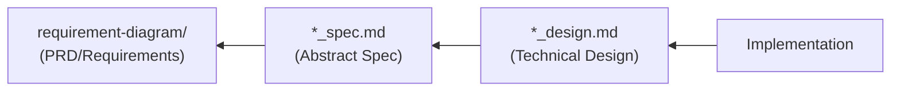

# Doc Consistency Checker - Document Consistency Check

Automatically checks consistency between AI-SDD documents (PRD, `*_spec.md`, `*_design.md`) and detects inconsistencies.

## Prerequisites

**Before execution, you must read `sdd-workflow:sdd-workflow` agent content to understand AI-SDD principles.**

This skill follows the sdd-workflow agent principles for document consistency checking.

## Document Dependencies



**Meaning of Dependency Direction**:

- `Implementation` is created referencing `*_design.md`
- `*_design.md` is created referencing `*_spec.md`
- `*_spec.md` is created referencing `requirement-diagram`

## Check Items

### 1. PRD ↔ spec Consistency

| Check Item | Description |
|:---|:---|
| **Requirement ID Mapping** | Are PRD requirement IDs referenced in spec? |
| **Functional Requirement Coverage** | Are PRD functional requirements covered in spec? |
| **Non-Functional Requirement Reflection** | Are PRD non-functional requirements reflected in spec? |
| **Terminology Consistency** | Is same terminology used in PRD and spec? |

### 2. spec ↔ design Consistency

| Check Item | Description |
|:---|:---|
| **API Definition Match** | Is spec API detailed in design? |
| **Data Model Match** | Do spec type definitions match design? |
| **Requirement Reflection in Design Decisions** | Are spec requirements reflected in design decisions? |
| **Constraint Consideration** | Are spec constraints considered in design? |

### 3. design ↔ Implementation Consistency

| Check Item | Description |
|:---|:---|
| **Module Structure Match** | Does design module structure match actual directory structure? |
| **Interface Definition Match** | Do design definitions match implementation code? |
| **Technology Stack Match** | Are libraries documented in design actually being used? |

## Automatic Detection Patterns

### Inconsistency Detection

1. **Missing**: Exists in upstream document but not reflected in downstream
2. **Contradiction**: Different content described in upstream and downstream
3. **Obsolescence**: Downstream changes not reflected in upstream

### Detection Method

```
1. Load target documents
   ↓
2. Extract the following elements:
   - Requirement IDs (PRD)
   - API definitions (spec)
   - Type definitions (spec, design)
   - Module structure (design)
   ↓
3. Compare across documents
   ↓
4. Detect and classify inconsistencies
```

## Output Format

```markdown
## Document Consistency Check Results

### Target Documents

| Document | Path | Last Updated |
|:---|:---|:---|
| PRD | `.docs/requirement-diagram/{feature-name}.md` | YYYY-MM-DD |
| spec | `.docs/specification/{feature-name}_spec.md` | YYYY-MM-DD |
| design | `.docs/specification/{feature-name}_design.md` | YYYY-MM-DD |

### Check Results Summary

| Check Target | Result | Count |
|:---|:---|:---|
| PRD ↔ spec | Consistent / Inconsistent | {n} items |
| spec ↔ design | Consistent / Inconsistent | {n} items |
| design ↔ Implementation | Consistent / Inconsistent | {n} items |

---

### Inconsistency Details

#### PRD ↔ spec

##### 1. {Inconsistency Title}

**Type**: Missing / Contradiction / Obsolescence

**PRD States**:
```markdown
{PRD content}
```

**spec States**:
```markdown
{spec content (or "Not documented")}
```

**Recommended Action**:
- [ ] Update spec to reflect requirement
- [ ] If PRD requirement is unnecessary, remove it

---

#### spec ↔ design

##### 1. {Inconsistency Title}

**Type**: Missing / Contradiction / Obsolescence

**spec States**:
```
{spec content}
```

**design States**:
```
{design content (or "Not documented")}
```

**Recommended Action**:
- [ ] Update design to reflect specification
- [ ] If spec is outdated, update it

---

#### design ↔ Implementation

##### 1. {Inconsistency Title}

**Type**: Missing / Contradiction / Obsolescence

**design States**:
```
{design content}
```

**Implementation**:
```
{Actual file structure/code}
```

**Recommended Action**:
- [ ] Update design to match implementation
- [ ] Fix implementation to match design

---

### Verified Consistent Items

- {Verified item 1}
- {Verified item 2}

---

### Recommended Actions (Prioritized)

1. **High Priority**: {Action}
2. **Medium Priority**: {Action}
3. **Low Priority**: {Action}

---

### Notes

- {Supplementary notes}
```

## Check Execution Timing

| Timing | Recommended Check |
|:---|:---|
| **Task Start** | Verify existing document existence and consistency |
| **Plan Completion** | spec ↔ design consistency |
| **Implementation Completion** | design ↔ implementation consistency |
| **Review** | All inter-document consistency |
| **Periodic Check** | Prevent documentation obsolescence |

## Document Update Triggers

Based on consistency check results, recommend document updates in the following cases:

### When to Update `*_spec.md`

- Public API signature changes (arguments, return values, types)
- New data model additions
- Fundamental changes to existing behavior
- When new requirements added in requirements diagram

### When to Update `*_design.md`

- Technology stack changes (library additions/changes)
- Important architectural decisions
- Module structure changes
- New design pattern introductions

### When Updates Are NOT Needed

- Internal implementation optimization (no interface changes)
- Bug fixes (correcting deviations from specifications)
- Refactoring (no behavior changes)

## Notes

- This skill **detects and reports** but does not auto-fix
- Inconsistency resolution is left to developer judgment
- Prioritize upstream documents (PRD > spec > design)
- Do not uniformly treat specs as correct, as implementation may be correct and specs outdated
