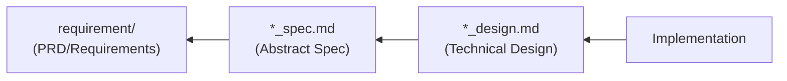

# Doc Consistency Checker - Document Consistency Check

Automatically checks consistency between AI-SDD documents (PRD, `*_spec.md`, `*_design.md`) and detects inconsistencies.

## Prerequisites

**Before execution, you must read `sdd-workflow:sdd-workflow` agent content to understand AI-SDD principles.**

This skill follows the sdd-workflow agent principles for document consistency checking.

### Directory Path Resolution

**Use `SDD_*` environment variables to resolve directory paths.**

| Environment Variable     | Default Value         | Description                  |
|:-------------------------|:----------------------|:-----------------------------|
| `SDD_DOCS_ROOT`          | `.sdd`                | Documentation root           |
| `SDD_REQUIREMENT_PATH`   | `.sdd/requirement`    | PRD/Requirements directory   |
| `SDD_SPECIFICATION_PATH` | `.sdd/specification`  | Specification/Design directory |
| `SDD_TASK_PATH`          | `.sdd/task`           | Task log directory           |

**Path Resolution Priority:**
1. Use `SDD_*` environment variables if set
2. Check `.sdd-config.json` if environment variables are not set
3. Use default values if neither exists

The following documentation uses default values, but replace with custom values if environment variables or configuration file exists.

## Document Dependencies



**Meaning of Dependency Direction**:

- `Implementation` is created referencing `*_design.md`
- `*_design.md` is created referencing `*_spec.md`
- `*_spec.md` is created referencing `requirement`

## Directory Structure Support

Both flat and hierarchical structures are supported.

**Flat Structure**:

```
.sdd/
├── requirement/{feature-name}.md
└── specification/
    ├── {feature-name}_spec.md
    └── {feature-name}_design.md
```

**Hierarchical Structure**:

```
.sdd/
├── requirement/
│   ├── {feature-name}.md                  # Top-level feature
│   └── {parent-feature}/
│       ├── index.md                       # Parent feature overview and requirements list
│       └── {child-feature}.md             # Child feature requirements
└── specification/
    ├── {feature-name}_spec.md             # Top-level feature
    ├── {feature-name}_design.md
    └── {parent-feature}/
        ├── index_spec.md                  # Parent feature abstract specification
        ├── index_design.md                # Parent feature technical design document
        ├── {child-feature}_spec.md        # Child feature abstract specification
        └── {child-feature}_design.md      # Child feature technical design document
```

Consistency checks also consider parent-child relationships for hierarchical structures.

## Check Items

### 1. PRD ↔ spec Consistency

| Check Item                                | Description                                            |
|:------------------------------------------|:-------------------------------------------------------|
| **Requirement ID Mapping**                | Are PRD requirement IDs referenced in spec?            |
| **Functional Requirement Coverage**       | Are PRD functional requirements covered in spec?       |
| **Non-Functional Requirement Reflection** | Are PRD non-functional requirements reflected in spec? |
| **Terminology Consistency**               | Is same terminology used in PRD and spec?              |

### 2. spec ↔ design Consistency

| Check Item                                     | Description                                          |
|:-----------------------------------------------|:-----------------------------------------------------|
| **API Definition Match**                       | Is spec API detailed in design?                      |
| **Data Model Match**                           | Do spec type definitions match design?               |
| **Requirement Reflection in Design Decisions** | Are spec requirements reflected in design decisions? |
| **Constraint Consideration**                   | Are spec constraints considered in design?           |

### 3. design ↔ Implementation Consistency

| Check Item                     | Description                                                    |
|:-------------------------------|:---------------------------------------------------------------|
| **Module Structure Match**     | Does design module structure match actual directory structure? |
| **Interface Definition Match** | Do design definitions match implementation code?               |
| **Technology Stack Match**     | Are libraries documented in design actually being used?        |

## Automatic Detection Patterns

### Inconsistency Detection

1. **Missing**: Exists in upstream document but not reflected in downstream
2. **Contradiction**: Different content described in upstream and downstream
3. **Obsolescence**: Downstream changes not reflected in upstream

### Detection Method

```
1. Load target documents
   ↓
2. Extract the following elements:
   - Requirement IDs (PRD)
   - API definitions (spec)
   - Type definitions (spec, design)
   - Module structure (design)
   ↓
3. Compare across documents
   ↓
4. Detect and classify inconsistencies
```

## Output Format

Use [templates/consistency_report.md](templates/consistency_report.md) for consistency check output.

## Check Execution Timing

| Timing                        | Recommended Check                                  |
|:------------------------------|:---------------------------------------------------|
| **Task Start**                | Verify existing document existence and consistency |
| **Plan Completion**           | spec ↔ design consistency                          |
| **Implementation Completion** | design ↔ implementation consistency                |
| **Review**                    | All inter-document consistency                     |
| **Periodic Check**            | Prevent documentation obsolescence                 |

## Document Update Triggers

Based on consistency check results, recommend document updates in the following cases:

### When to Update `*_spec.md`

- Public API signature changes (arguments, return values, types)
- New data model additions
- Fundamental changes to existing behavior
- When new requirements added in requirements diagram

### When to Update `*_design.md`

- Technology stack changes (library additions/changes)
- Important architectural decisions
- Module structure changes
- New design pattern introductions

### When Updates Are NOT Needed

- Internal implementation optimization (no interface changes)
- Bug fixes (correcting deviations from specifications)
- Refactoring (no behavior changes)

## Notes

- This skill **detects and reports** but does not auto-fix
- Inconsistency resolution is left to developer judgment
- Prioritize upstream documents (PRD > spec > design)
- Do not uniformly treat specs as correct, as implementation may be correct and specs outdated
