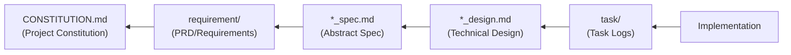

# SDD Templates - AI-SDD Document Templates (Fallback)

Provides templates for various documents used in the AI-SDD workflow.

## Important: Template Selection Procedure

**These templates are fallbacks. You MUST follow the procedure below.**

### Required Verification Steps

When generating documents, **always search for templates in this order**:

```
1. Check for project files/templates (HIGHEST PRIORITY)
   ├─ Does .sdd/CONSTITUTION.md exist?
   ├─ Does .sdd/PRD_TEMPLATE.md exist?
   ├─ Does .sdd/SPECIFICATION_TEMPLATE.md exist?
   └─ Does .sdd/DESIGN_DOC_TEMPLATE.md exist?
   ↓
2. If project files/templates EXIST
   → Use those files (DO NOT use this skill's templates)
   ↓
3. ONLY if project files/templates do NOT exist
   → Use this skill's templates to generate project-specific files
```

### Template Priority (STRICTLY ENFORCED)

| Priority         | Template          | Path                      | Usage Condition                         |
|:-----------------|:------------------|:--------------------------|:----------------------------------------|
| **1 (Highest)**  | Project templates | `.sdd/*.md`               | Use if exists                           |
| **2 (Fallback)** | Plugin templates  | This skill's `templates/` | ONLY when project templates don't exist |

## Prerequisites

**Before execution, you must read `sdd-workflow:sdd-workflow` agent content to understand AI-SDD principles.**

This skill provides templates that follow the sdd-workflow agent principles.

### Directory Path Resolution

**Use `SDD_*` environment variables to resolve directory paths.**

| Environment Variable     | Default Value        | Description                    |
|:-------------------------|:---------------------|:-------------------------------|
| `SDD_ROOT`               | `.sdd`               | Root directory                 |
| `SDD_REQUIREMENT_PATH`   | `.sdd/requirement`   | PRD/Requirements directory     |
| `SDD_SPECIFICATION_PATH` | `.sdd/specification` | Specification/Design directory |
| `SDD_TASK_PATH`          | `.sdd/task`          | Task log directory             |

**Path Resolution Priority:**

1. Use `SDD_*` environment variables if set
2. Check `.sdd-config.json` if environment variables are not set
3. Use default values if neither exists

When generating templates, adjust paths within templates based on the environment variables or configuration file's
directory names.

## Fallback Templates

Used only when project templates do not exist:

| Template                             | File                                                                                 | Corresponding Project Template        |
|:-------------------------------------|:-------------------------------------------------------------------------------------|:--------------------------------------|
| **PRD (Requirements Specification)** | [templates/prd_template.md](templates/prd_template.md)                               | `.sdd/PRD_TEMPLATE.md`                |
| **Abstract Specification**           | [templates/spec_template.md](templates/spec_template.md)                             | `.sdd/SPECIFICATION_TEMPLATE.md`      |
| **Technical Design Doc**             | [templates/design_template.md](templates/design_template.md)                         | `.sdd/DESIGN_DOC_TEMPLATE.md`         |
| **Quality Checklist**                | [templates/checklist_template.md](templates/checklist_template.md)                   | `.sdd/CHECKLIST_TEMPLATE.md`          |
| **Project Constitution**             | [templates/constitution_template.md](templates/constitution_template.md)             | `.sdd/CONSTITUTION.md`                |
| **Implementation Log**               | [templates/implementation_log_template.md](templates/implementation_log_template.md) | `.sdd/IMPLEMENTATION_LOG_TEMPLATE.md` |

## Usage

### Case 1: Project Constitution Generation (/sdd_init or /constitution init)

```
/sdd_init
or
/constitution init

1. Check .sdd/CONSTITUTION.md
2. EXISTS → Skip (respect existing constitution)
3. Does NOT exist:
   - Reference this skill's templates/constitution_template.md
   - Analyze project context (language, framework, domain)
   - Generate customized constitution to .sdd/CONSTITUTION.md
```

### Case 2: Project Template EXISTS

```
/generate_spec {specifications}

1. Check .sdd/SPECIFICATION_TEMPLATE.md
2. EXISTS → Use that template
3. DO NOT reference this skill's templates
```

### Case 3: Project Template Does NOT Exist

```
/generate_spec {specifications}

1. Check .sdd/SPECIFICATION_TEMPLATE.md
2. Does NOT exist → Use this skill's templates
3. Customize according to project's language and structure
4. Recommend saving to .sdd/ as project template after generation
```

### Initializing Project Templates

If your project has no templates, initialize with these steps:

1. Run `/sdd_init` command (recommended)
2. Or manually copy this skill's templates to `.sdd/`
3. Modify type definition syntax to match project's programming language
4. Adjust paths to match project's directory structure
5. Project templates will take priority thereafter

## Template Overview

### PRD (Requirements Specification) Template

Defines the following in SysML Requirements Diagram format:

- Background and Purpose
- User Requirements (UR-xxx)
- Functional Requirements (FR-xxx)
- Non-Functional Requirements (NFR-xxx)
- Requirements Diagram (Mermaid)
- Constraints and Assumptions

### Abstract Specification Template

Defines the logical structure of the system:

- Background and Overview
- Functional Requirements (with PRD requirement ID mapping)
- Public API (SysML bdd format)
- Data Model
- Behavior (Sequence Diagrams)

### Technical Design Doc Template

Defines concrete implementation plans:

- Implementation Status
- Design Goals
- Technology Stack
- Architecture
- Design Decisions and Rationale

### Quality Checklist Template

Comprehensive QA checklist organized by category:

- Requirements Review
- Specification Review
- Design Review
- Implementation Review
- Testing Review
- Documentation Review
- Security Review
- Performance Review
- Deployment Review

Each item has priority levels (P0-P3) and verification methods.

### Project Constitution Template

Non-negotiable project principles and standards:

- Core Principles (P1, P2, P3, ...)
- Development Standards (code quality, documentation, testing, security)
- Architectural Constraints
- Decision-Making Framework
- Version History and Amendment Process

### Implementation Log Template

Tracks implementation progress and decisions:

- Daily session logs
- Design decisions made during implementation
- Challenges encountered and solutions
- Testing summary
- Performance metrics
- Technical debt incurred
- Lessons learned

## Document Dependencies



Each template is designed to ensure traceability based on this dependency relationship.

**CONSTITUTION.md is the highest level**: All documents are created following the project constitution principles.

## Notes

- Templates are **structural guidelines**; not all sections are mandatory
- Select necessary sections according to project scale and nature
- Manage requirement IDs (UR-xxx, FR-xxx, NFR-xxx) uniquely and enable cross-document references
