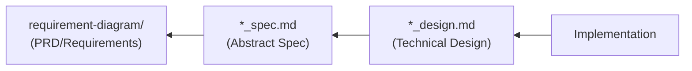

# SDD Templates - AI-SDD Document Templates (Fallback)

Provides templates for various documents used in the AI-SDD workflow.

## Important: Template Selection Procedure

**These templates are fallbacks. You MUST follow the procedure below.**

### Required Verification Steps

When generating documents, **always search for templates in this order**:

```
1. Check for project templates (HIGHEST PRIORITY)
   ├─ Does .docs/PRD_TEMPLATE.md exist?
   ├─ Does .docs/SPECIFICATION_TEMPLATE.md exist?
   └─ Does .docs/DESIGN_DOC_TEMPLATE.md exist?
   ↓
2. If project template EXISTS
   → Use that template (DO NOT use this skill's templates)
   ↓
3. ONLY if project template does NOT exist
   → Use this skill's templates to generate project-specific templates
```

### Template Priority (STRICTLY ENFORCED)

| Priority         | Template          | Path                      | Usage Condition                         |
|:-----------------|:------------------|:--------------------------|:----------------------------------------|
| **1 (Highest)**  | Project templates | `.docs/*.md`              | Use if exists                           |
| **2 (Fallback)** | Plugin templates  | This skill's `templates/` | ONLY when project templates don't exist |

## Prerequisites

**Before execution, you must read `sdd-workflow:sdd-workflow` agent content to understand AI-SDD principles.**

This skill provides templates that follow the sdd-workflow agent principles.

## Fallback Templates

Used only when project templates do not exist:

| Template                             | File                                                         | Corresponding Project Template    |
|:-------------------------------------|:-------------------------------------------------------------|:----------------------------------|
| **PRD (Requirements Specification)** | [templates/prd_template.md](templates/prd_template.md)       | `.docs/PRD_TEMPLATE.md`           |
| **Abstract Specification**           | [templates/spec_template.md](templates/spec_template.md)     | `.docs/SPECIFICATION_TEMPLATE.md` |
| **Technical Design Doc**             | [templates/design_template.md](templates/design_template.md) | `.docs/DESIGN_DOC_TEMPLATE.md`    |

## Usage

### Case 1: Project Template EXISTS

```
/generate_spec {specifications}

1. Check .docs/SPECIFICATION_TEMPLATE.md
2. EXISTS → Use that template
3. DO NOT reference this skill's templates
```

### Case 2: Project Template Does NOT Exist

```
/generate_spec {specifications}

1. Check .docs/SPECIFICATION_TEMPLATE.md
2. Does NOT exist → Use this skill's templates
3. Customize according to project's language and structure
4. Recommend saving to .docs/ as project template after generation
```

### Initializing Project Templates

If your project has no templates, initialize with these steps:

1. Copy this skill's templates to `.docs/`
2. Modify type definition syntax to match project's programming language
3. Adjust paths to match project's directory structure
4. Project templates will take priority thereafter

## Template Overview

### PRD (Requirements Specification) Template

Defines the following in SysML Requirements Diagram format:

- Background and Purpose
- User Requirements (UR-xxx)
- Functional Requirements (FR-xxx)
- Non-Functional Requirements (NFR-xxx)
- Requirements Diagram (Mermaid)
- Constraints and Assumptions

### Abstract Specification Template

Defines the logical structure of the system:

- Background and Overview
- Functional Requirements (with PRD requirement ID mapping)
- Public API (SysML bdd format)
- Data Model
- Behavior (Sequence Diagrams)

### Technical Design Doc Template

Defines concrete implementation plans:

- Implementation Status
- Design Goals
- Technology Stack
- Architecture
- Design Decisions and Rationale

## Document Dependencies



Each template is designed to ensure traceability based on this dependency relationship.

## Notes

- Templates are **structural guidelines**; not all sections are mandatory
- Select necessary sections according to project scale and nature
- Manage requirement IDs (UR-xxx, FR-xxx, NFR-xxx) uniquely and enable cross-document references
