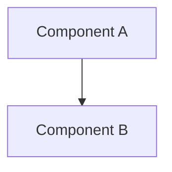

# Technical Design Document Template (Design Doc)

This document is a template for creating Technical Design Documents under `.sdd/specification/`.
The filename should be `{feature-name}_design.md`.

> **Note**: This template is a fallback for the plugin.
> When using in a project, customize it according to your programming language and project structure,
> and save it as `.sdd/DESIGN_DOC_TEMPLATE.md`.

## Difference from Abstract Specification

| Document        | SDD Phase         | Role and Focus                                                                                     | Abstraction           |
|-----------------|-------------------|----------------------------------------------------------------------------------------------------|-----------------------|
| `xxx_spec.md`   | **Specify**       | **"What to build" "Why to build"** - Defines abstract structure and behavior. No technical details | High (Abstract)       |
| `xxx_design.md` | **Plan (Design)** | **"How to implement"** - Concrete technical design. Ensures design decision transparency           | Medium-Low (Concrete) |

---

# {Feature Name} `<MUST>`

**Document Type:** Technical Design Document (Design Doc)
**SDD Phase:** Plan (Design)
**Last Updated:** YYYY-MM-DD
**Related Spec:** [link to xxx_spec.md]
**Related PRD:** [link to requirement/{feature-name}.md]

---

# 1. Implementation Status `<MUST>`

**Status:** 🟢 Implemented / 🟡 Partial / 🔴 Not Implemented

## 1.1. Implementation Progress `<OPTIONAL>`

| Module/Feature | Status   | Notes   |
|----------------|----------|---------|
| [Module]       | 🟢/🟡/🔴 | [Notes] |

---

# 2. Design Goals `<MUST>`

Describe the main technical goals this design must achieve.

---

# 3. Technology Stack `<MUST>`

**Clearly document the rationale for why each technology was chosen.**

| Area   | Technology | Selection Rationale |
|--------|------------|---------------------|
| [Area] | [Tech]     | [Rationale]         |

---

# 4. Architecture `<MUST>`

## 4.1. System Architecture Diagram



## 4.2. Module Structure

| Module Name | Responsibility   | Dependencies   | Location |
|-------------|------------------|----------------|----------|
| [Name]      | [Responsibility] | [Dependencies] | [Path]   |

---

# 5. Data Model `<OPTIONAL>`

<!--
Modify the notation according to your project's programming language.
e.g., TypeScript, Go, Python, Kotlin, etc.
-->

```
// Describe data model according to your project's language
interface SomeEntity {
  id: string
  name: string
}
```

---

# 6. Interface Definition `<OPTIONAL>`

<!--
Modify the notation according to your project's programming language.
-->

```
// Describe interface definitions according to your project's language
interface SomeRepository {
  fetch(): Promise<Data>
}
```

---

# 7. Non-Functional Requirements Implementation `<OPTIONAL>`

| Requirement   | Implementation Approach |
|---------------|-------------------------|
| [Requirement] | [Approach]              |

---

# 8. Test Strategy `<OPTIONAL>`

| Test Level | Target   | Coverage Goal |
|------------|----------|---------------|
| [Level]    | [Target] | [Goal]        |

---

# 9. Design Decisions `<MUST>`

## 9.1. Decisions Made

| Decision   | Options   | Chosen   | Rationale   |
|------------|-----------|----------|-------------|
| [Decision] | [Options] | [Chosen] | [Rationale] |

## 9.2. Unresolved Issues `<OPTIONAL>`

| Issue   | Impact   | Proposed Resolution |
|---------|----------|---------------------|
| [Issue] | [Impact] | [Resolution]        |

---

# 10. Change History `<OPTIONAL>`

## vX.X

**Changes:**

- Change 1

**Migration Guide:**

<!--
Modify the notation according to your project's programming language.
-->

```
// ❌ Old code
// ✅ New code
```

---

# Section Requirement Legend

| Marker          | Meaning     | Description                              |
|-----------------|-------------|------------------------------------------|
| `<MUST>`        | Required    | Must be included in all design documents |
| `<RECOMMENDED>` | Recommended | Include whenever possible                |
| `<OPTIONAL>`    | Optional    | Include as needed                        |

---

# Guidelines

## What to Include

- ✅ Implementation status and progress
- ✅ Technology stack selection rationale
- ✅ Architecture and module structure
- ✅ Implementation patterns and design patterns
- ✅ Directory structure and file placement
- ✅ Test strategy and coverage goals
- ✅ Design decision records
- ✅ Change history and migration guides

## What NOT to Include (→ Spec)

- ❌ Feature purpose and background
- ❌ User stories and use cases
- ❌ Public API (interface) definitions
- ❌ Logical structure of data models
- ❌ Abstract description of behavior
- ❌ Functional and non-functional requirements
- ❌ Glossary

---

# Customization Guidelines for Projects

When customizing this template for your project, update the following:

1. **Data model notation**: Adjust to project's programming language
2. **Interface definition notation**: Adjust to project's programming language
3. **Change history code examples**: Adjust to project's programming language
4. **Module structure table columns**: Adjust to project's structure (package/module organization)
5. **Technology stack table**: Adjust to technology areas used in the project

---

**This Design Doc serves as the guideline for concrete code generation that AI agents reference during the Implement
phase.**
