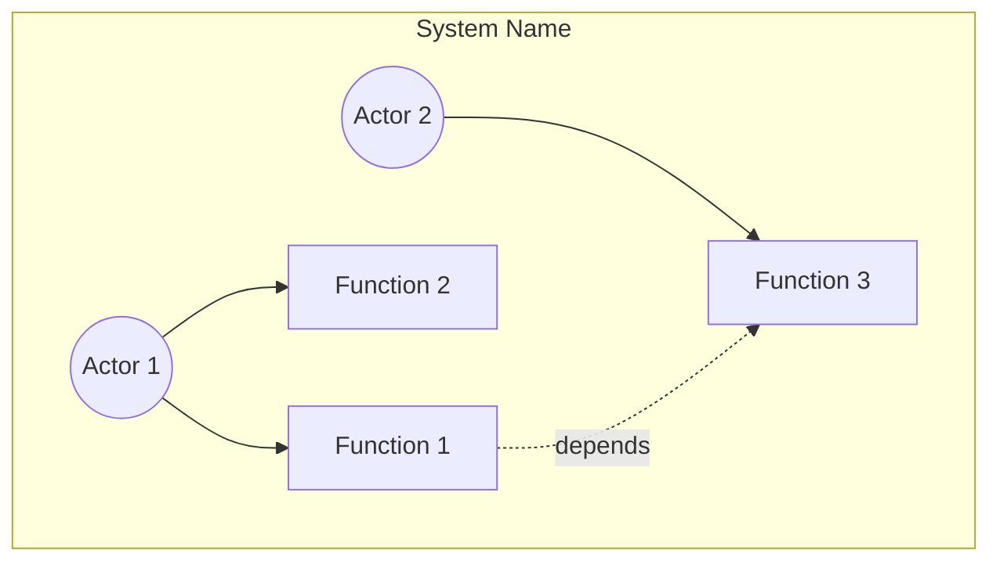
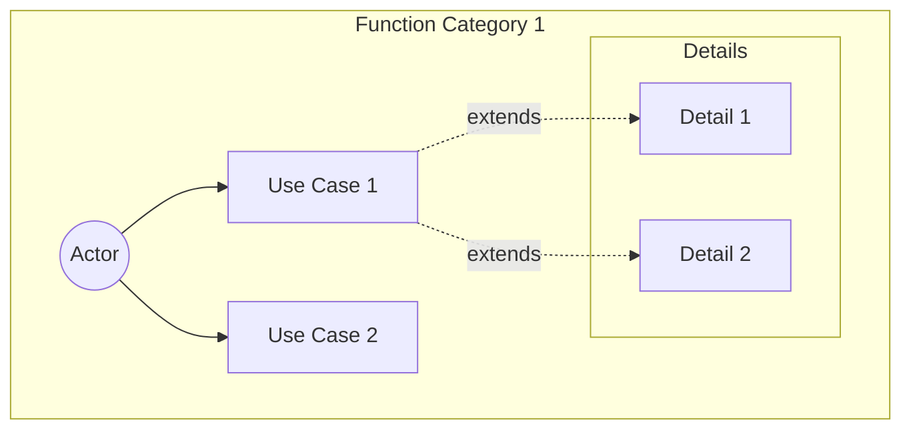
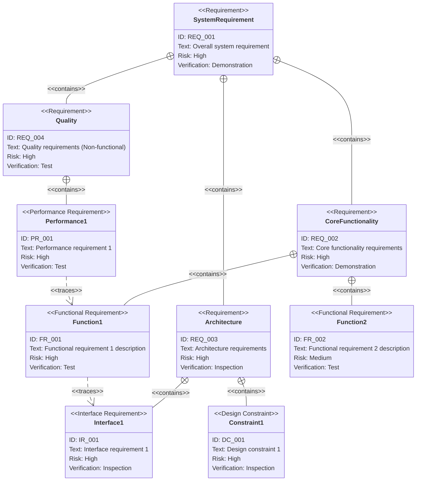
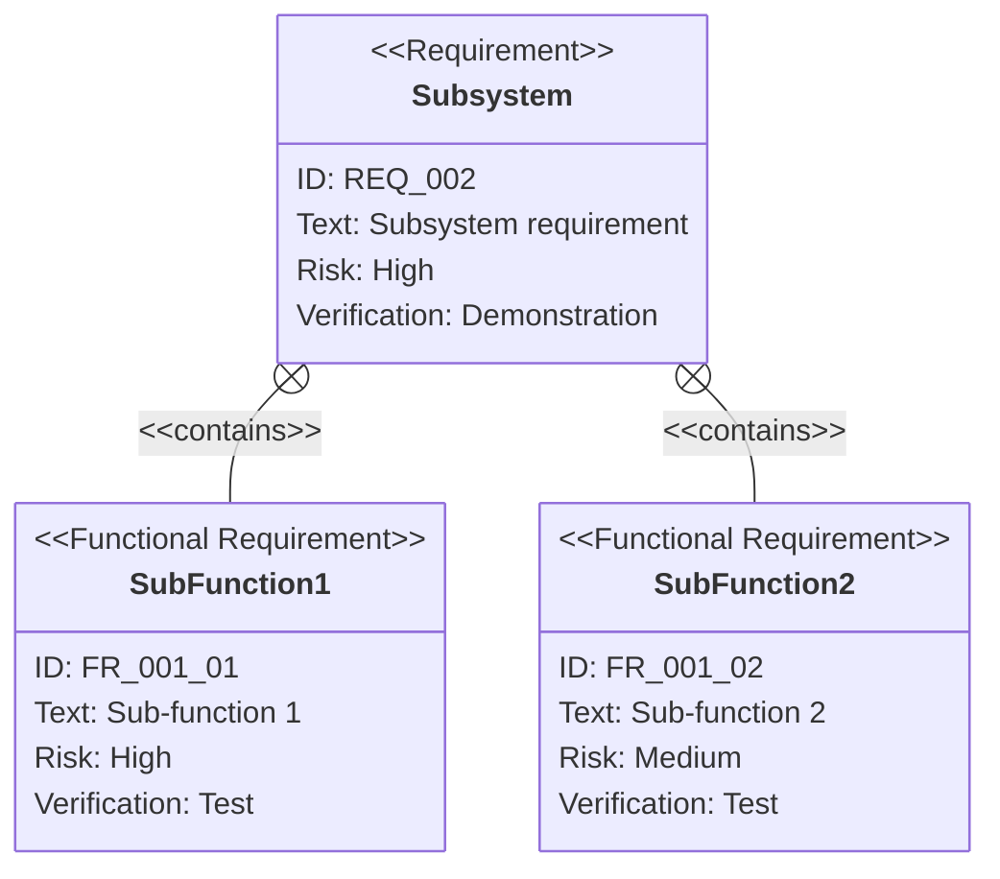

# PRD (Product Requirements Document) Template

This document is a template for creating PRD (Product Requirements Document) under `.sdd/requirement/`.
The filename should be `{feature-name}.md`.

> **Note**: This template is a fallback for the plugin.
> When using in a project, customize it according to your project structure and
> save it as `.sdd/PRD_TEMPLATE.md`.

## Difference from Spec / Design Doc

| Document           | SDD Phase         | Role and Focus                                                                           | Abstraction           |
|--------------------|-------------------|------------------------------------------------------------------------------------------|-----------------------|
| `requirement/*.md` | **Specify**       | **"What to build" "Why to build"** - Defines business requirements. No technical details | Highest (Abstract)    |
| `xxx_spec.md`      | **Specify**       | **"What to build"** - Defines abstract structure and behavior. No technical details      | High (Abstract)       |
| `xxx_design.md`    | **Plan (Design)** | **"How to implement"** - Concrete technical design. Ensures design decision transparency | Medium-Low (Concrete) |

---

# {Feature Name} Requirements Specification `<MUST>`

## Overview `<MUST>`

Briefly describe the purpose and scope of this document.

---

# 1. How to Read Requirements Diagrams `<RECOMMENDED>`

## 1.1. Requirement Types

- **requirement**: General requirement
- **functionalRequirement**: Functional requirement
- **performanceRequirement**: Performance requirement
- **interfaceRequirement**: Interface requirement
- **designConstraint**: Design constraint

## 1.2. Risk Levels

- **High**: High risk (Business critical, difficult to implement)
- **Medium**: Medium risk (Important but alternatives exist)
- **Low**: Low risk (Nice to have)

## 1.3. Verification Methods

- **Analysis**: Verification by analysis
- **Test**: Verification by testing
- **Demonstration**: Verification by demonstration
- **Inspection**: Verification by inspection (review)

## 1.4. Relationship Types

- **contains**: Containment relationship (parent requirement contains child requirements)
- **derives**: Derivation relationship (requirement derives another requirement)
- **satisfies**: Satisfaction relationship (element satisfies requirement)
- **verifies**: Verification relationship (test case verifies requirement)
- **refines**: Refinement relationship (defines requirement in more detail)
- **traces**: Trace relationship (traceability between requirements)

---

# 2. Requirements List `<MUST>`

## 2.1. Use Case Diagram (Overview) `<RECOMMENDED>`

Overview diagram showing the relationship between main functions and actors.

## 2.2. Use Case Diagram (Detailed) `<OPTIONAL>`

### {Function Category 1}

## 2.3. Function List (Text Format) `<MUST>`

- Function Category 1
    - Sub-function 1-1
        - Detail 1-1-1
        - Detail 1-1-2
    - Sub-function 1-2
- Function Category 2
    - Sub-function 2-1

---

# 3. Requirements Diagram (SysML Requirements Diagram) `<MUST>`

## 3.1. Overall Requirements Diagram

## 3.2. Major Subsystem Detail Diagrams `<OPTIONAL>`

### {Subsystem Name}

---

# 4. Detailed Requirements Description `<MUST>`

## 4.1. Functional Requirements

### FR_001: {Functional Requirement Name}

{Detailed description of the function}

**Included functions:**

- FR_001_01: {Sub-function 1}
- FR_001_02: {Sub-function 2}

**Verification method:** Test

### FR_002: {Functional Requirement Name}

{Detailed description of the function}

**Verification method:** Test

## 4.2. Performance Requirements `<OPTIONAL>`

### PR_001: {Performance Requirement Name}

{Detailed description and target values for performance requirement}

**Verification method:** Test

## 4.3. Interface Requirements `<OPTIONAL>`

### IR_001: {Interface Requirement Name}

{Detailed description of interface requirement}

**Verification method:** Inspection

## 4.4. Design Constraints `<OPTIONAL>`

### DC_001: {Design Constraint Name}

{Detailed description of design constraint}

**Verification method:** Inspection

---

# 5. Constraints `<OPTIONAL>`

## 5.1. Technical Constraints

- Technical constraints

## 5.2. Business Constraints

- Business constraints (schedule, budget, etc.)

---

# 6. Assumptions `<OPTIONAL>`

- Prerequisites for this feature to work
- Dependent systems/features

---

# 7. Out of Scope `<OPTIONAL>`

The following are out of scope for this PRD:

- Items not included in this feature
- May be considered in the future but excluded for now

---

# 8. Glossary `<RECOMMENDED>`

> **Note**: If the glossary becomes large, consider managing it as a separate file (`glossary.md`).

| Term   | Definition   |
|--------|--------------|
| [Term] | [Definition] |

---

# Section Requirement Legend

| Marker          | Meaning     | Description                  |
|-----------------|-------------|------------------------------|
| `<MUST>`        | Required    | Must be included in all PRDs |
| `<RECOMMENDED>` | Recommended | Include whenever possible    |
| `<OPTIONAL>`    | Optional    | Include as needed            |

---

# Guidelines

## What to Include

- ✅ Overview and purpose
- ✅ Use case diagrams (overview and detailed)
- ✅ SysML requirements diagrams (requirementDiagram syntax)
- ✅ Detailed requirements descriptions (functional, performance, interface requirements, design constraints)
- ✅ Requirement relationships (contains, derives, satisfies, verifies, refines, traces)
- ✅ Constraints and assumptions
- ✅ Explicit out of scope
- ✅ Glossary

## What NOT to Include (→ Spec / Design Doc)

- ❌ Technical implementation details
- ❌ Architecture and module structure
- ❌ Technology stack selection
- ❌ API definitions and type definitions
- ❌ Database schema

---

# Customization Guidelines for Projects

When customizing this template for your project, update the following:

1. **Requirement ID naming convention**: Adjust to project conventions (if using prefixes other than REQ/FR/PR/IR/DC)
2. **Risk level classification**: Adjust to project's risk evaluation criteria
3. **Verification method classification**: Adjust to project's verification process
4. **Use case diagram style**: Adjust to project's actor and function structure
5. **Glossary management**: Decide whether to manage as separate file or include in PRD

---

**This PRD serves as the source of truth for business requirements that AI agents reference during the Specify phase.**
