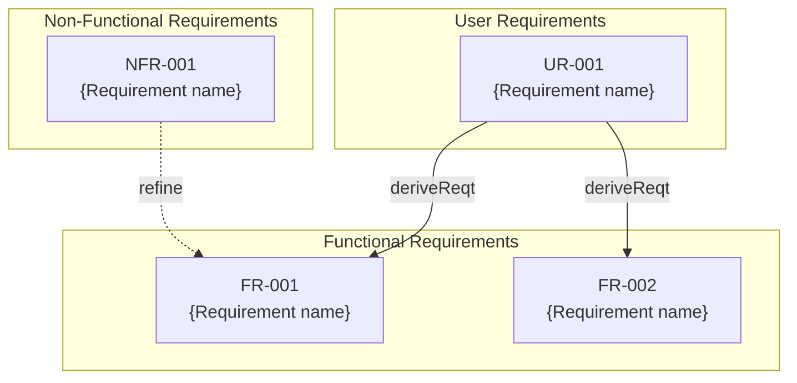

# PRD (Product Requirements Document) Template

This document is a template for creating PRD (Product Requirements Document) under `.docs/requirement-diagram/`.
The filename should be `{feature-name}.md`.

> **Note**: This template is a fallback for the plugin.
> When using in a project, customize it according to your project structure and
> save it as `.docs/PRD_TEMPLATE.md`.

## Difference from Spec / Design Doc

| Document                   | SDD Phase         | Role and Focus                                                                           | Abstraction           |
|----------------------------|-------------------|------------------------------------------------------------------------------------------|-----------------------|
| `requirement-diagram/*.md` | **Specify**       | **"What to build" "Why to build"** - Defines business requirements. No technical details | Highest (Abstract)    |
| `xxx_spec.md`              | **Specify**       | **"What to build"** - Defines abstract structure and behavior. No technical details      | High (Abstract)       |
| `xxx_design.md`            | **Plan (Design)** | **"How to implement"** - Concrete technical design. Ensures design decision transparency | Medium-Low (Concrete) |

---

# {Feature Name} Product Requirements Document (PRD) `<MUST>`

**Document Type:** PRD (Product Requirements Document)
**SDD Phase:** Specify - Upstream
**Last Updated:** YYYY-MM-DD
**Status:** Draft / Review / Approved
**Related Spec:** [link to xxx_spec.md]
**Related Design Doc:** [link to xxx_design.md]

---

# 1. Background and Purpose `<MUST>`

## 1.1. Background

Describe why this feature is needed and current challenges.

## 1.2. Purpose

Describe what this feature aims to achieve and its business value.

## 1.3. Success Criteria `<RECOMMENDED>`

- Quantitative or qualitative success metrics

---

# 2. Requirements Definition `<MUST>`

## 2.1. User Requirements

Define requirements from the user's perspective.

| ID     | Requirement      | Priority              | Verification Method |
|--------|------------------|-----------------------|---------------------|
| UR-001 | [User can do...] | Must / Should / Could | [Method]            |

## 2.2. Functional Requirements

Define functions the system must provide.

| ID     | Requirement       | Derived From | Priority              | Verification Method |
|--------|-------------------|--------------|-----------------------|---------------------|
| FR-001 | [System shall...] | UR-001       | Must / Should / Could | [Method]            |

## 2.3. Non-Functional Requirements `<OPTIONAL>`

| ID      | Category    | Requirement          | Priority              | Verification Method |
|---------|-------------|----------------------|-----------------------|---------------------|
| NFR-001 | Performance | [Response time etc.] | Must / Should / Could | [Method]            |
| NFR-002 | Security    | [Auth etc.]          | Must / Should / Could | [Method]            |

---

# 3. Requirements Diagram (SysML Requirements Diagram) `<RECOMMENDED>`

## 3.1. Requirements Relationship Legend

| Relationship | Meaning                                             | Notation     |
|--------------|-----------------------------------------------------|--------------|
| deriveReqt   | Derivation (derive lower requirements from higher)  | Solid arrow  |
| refine       | Refinement (make abstract requirements concrete)    | Dashed arrow |
| satisfy      | Satisfaction (design element satisfies requirement) | -            |
| verify       | Verification (test case verifies requirement)       | -            |
| trace        | Trace (general association between requirements)    | -            |

---

# 4. Constraints `<OPTIONAL>`

## 4.1. Technical Constraints

- Technical constraints

## 4.2. Business Constraints

- Business constraints (schedule, budget, etc.)

---

# 5. Assumptions `<OPTIONAL>`

- Prerequisites for this feature to work
- Dependent systems/features

---

# 6. Out of Scope `<OPTIONAL>`

The following are out of scope for this PRD:

- Items not included in this feature
- May be considered in the future but excluded for now

---

# 7. Glossary `<OPTIONAL>`

| Term   | Definition   |
|--------|--------------|
| [Term] | [Definition] |

---

# Section Requirement Legend

| Marker          | Meaning     | Description                  |
|-----------------|-------------|------------------------------|
| `<MUST>`        | Required    | Must be included in all PRDs |
| `<RECOMMENDED>` | Recommended | Include whenever possible    |
| `<OPTIONAL>`    | Optional    | Include as needed            |

---

# Guidelines

## What to Include

- ✅ Business requirements and background
- ✅ User Requirements (UR-xxx)
- ✅ Functional Requirements (FR-xxx)
- ✅ Non-Functional Requirements (NFR-xxx)
- ✅ Requirement relationships (derivation, refinement)
- ✅ Constraints and assumptions
- ✅ Explicit out of scope

## What NOT to Include (→ Spec / Design Doc)

- ❌ Technical implementation details
- ❌ Architecture and module structure
- ❌ Technology stack selection
- ❌ API definitions and type definitions
- ❌ Database schema

---

# Customization Guidelines for Projects

When customizing this template for your project, update the following:

1. **Requirement ID naming convention**: Adjust to project conventions (if using prefixes other than UR/FR/NFR)
2. **Priority classification**: Adjust to project's prioritization method (if not using MoSCoW)
3. **Related document link format**: Adjust to project's document management method
4. **Non-functional requirement categories**: Adjust to quality characteristics important to the project

---

**This PRD serves as the source of truth for business requirements that AI agents reference during the Specify phase.**
